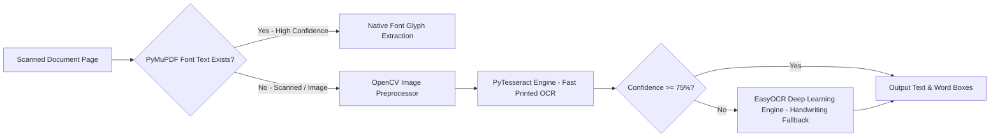

# IntelliGrade - Technology Stack & Infrastructure Specification

**Document Version:** 4.0.0 (Enterprise Academic Release)  
**Last Updated:** August 30, 2026  
**Auditor:** Principal Enterprise Systems Architect  

---

## 1. Complete Technology Stack Matrix

```text
====================================================================================================
SYSTEM LAYER          TECHNOLOGY / LIBRARY                VERSION        FUNCTION & IMPLEMENTATION
====================================================================================================
Backend Core          Python                              3.11 / 3.13+   Core runtime execution environment
                      Django                              5.2.x          Monolithic web framework, ORM & MVT engine
                      Django REST Framework (DRF)         3.15.x         JSON API serialization & endpoint routing

Database Layer        SQLite (Dev / Local)                3.45+          Fast local development relational DB
                      PostgreSQL (Production Target)      16.x           Enterprise ACID relational DB with JSONB
                      Django ORM (with Composite Indexes) 5.2.x          Composite B-Tree indexes & JSONFields

Document & PDF Engine PyMuPDF (fitz)                      1.24.x         300 DPI rendering & native glyph text map
                      ReportLab                           4.2.x          Certified PDF evaluation stamp & watermarking
                      PyPDF2                              3.0.x          PDF manipulation and metadata extraction

Vision & Preprocess   OpenCV (opencv-python)              4.10.x         Deskewing, thresholding, noise removal
                      Pillow (PIL)                        10.4.x         LANCZOS downsampling, cropping, thumbnails
                      NumPy                               1.26.x         Matrix coordinates for bounding boxes

OCR Engines           PyTesseract                         0.3.10+        High-speed printed text OCR
                      Tesseract OCR Engine (Binary)       v5.3+          Native C++ OCR backend
                      EasyOCR                             1.7.x          Deep learning OCR (handwriting fallback)
                      PyTorch CPU (torch, torchvision)    2.4.x          PyTorch runtime powering EasyOCR models

AI Provider Matrix    Local Offline Vision (Moondream2)   v2.0           Local multimodal vision (800px LANCZOS, 0 cost)
                      Ollama API                          0.3.x          Local LLM inference server (Llama 3 / Mistral)
                      Groq API (groq)                     0.9.x          Ultra-low latency cloud LLM (Llama-3.3 70B)
                      Google GenAI (google-generativeai)  0.8.x          Gemini 2.5 Flash, Gemini 2.0 Flash
                      OpenRouter API                      v1 REST        Multi-model cloud aggregator & fallback gateway
                      OpenAI API (openai)                 1.40.x         GPT-4o, GPT-4o-mini reasoning models

Excel & Spreadsheet   openpyxl                            3.1.x          8-sheet OBE Excel generation & dynamic formulas

Email & Background    Django Core Mail                    5.2.x          Multi-part HTML & text SMTP dispatch
                      Python threading.Thread             Standard Lib   Asynchronous non-blocking background workers
                      Institutional SMTP Server           dsr.iubat.ac.bd Official email gateway (Port 465 / SSL)

Cache & Security      Django LocMemCache / DB Cache       5.2.x          6-digit OTP lifecycle for password reset

Frontend & UI         HTML5 / CSS3 / Vanilla JavaScript   ES6+           Interactive UI components & AJAX fetch pipelines
                      TailwindCSS                         3.4.x          Utility-first design system & dark mode
                      Lucide Icons / Google Fonts         Latest         Modern academic typography & iconography

Development Tools     Visual Studio Code / Cursor IDE     Latest         Integrated development environment
                      Git / GitHub                        2.45+          Distributed version control (branch: dev)
====================================================================================================
```

---

## 2. Architectural Layer Details

### 2.1 Backend Framework & Database ORM
- **Framework**: Django 5.2.x with clean separation of concerns across Model-View-Template (MVT) architecture and JSON API micro-endpoints.
- **Database Indexing Optimization**:
  - `StudentSubmission`: Composite index on `(examination, status)`, filter index on `student_roll_no`, boolean index on `is_finalized`.
  - `EvaluationResult`: Composite index on `(status, requires_manual_review)`.
  - `QuestionMapping`: Composite indexes on `(submission, mapping_status)` and `(submission, is_confirmed)`.
  - `StudentGradeRecord`: Composite indexes on `(tabulation, student_id)`, `(tabulation, overall_score)`, and `(is_manually_edited)`.
- **N+1 Query Elimination**: All workbench and tabulation queries employ `.select_related()` and `.prefetch_related()` across rubrics, figures, tables, formulas, and evaluation results.

### 2.2 Document Processing & Image Preprocessing Pipeline
- **PyMuPDF (fitz)**: Reads multi-page PDF documents, extracts embedded font text directly, and renders rasterized pages at 300 DPI (`zoom = 300 / 72 = 4.166`).
- **Skia/PDF Glyph Noise Cleaner**: Employs regex filters (`r'node\d{6,}'`) to remove PostScript font glyph artifacts produced by PDF printer drivers.
- **OpenCV & Pillow**:
  - Image deskewing via Hough Line Transforms.
  - Adaptive Gaussian thresholding and Otsu binarization.
  - Dynamic cropping and coordinate normalization (`[ymin, xmin, ymax, xmax]`) for answer region segmentation.

### 2.3 Hybrid Multi-Engine OCR Architecture


### 2.4 Multimodal AI Engine & Failover Orchestrator
- **Failover Chain & Rate-Limit Shield**:
  1. `LocalOfflineVisionProvider` (Moondream2 on CPU / Ollama with 800px LANCZOS JPEG quality 75) -> Zero API cost, operates offline.
  2. `GroqProvider` (`llama-3.3-70b-versatile`) -> Sub-second execution for fast text evaluation.
  3. `OpenRouterProvider` -> Cloud gateway fallback to Mistral, Claude, or DeepSeek.
  4. `GeminiProvider` (`gemini-2.5-flash` / `gemini-2.0-flash`) -> High-accuracy multimodal vision evaluation.
  5. `OpenAIProvider` (`gpt-4o` / `gpt-4o-mini`) -> High-reasoning fallback.
