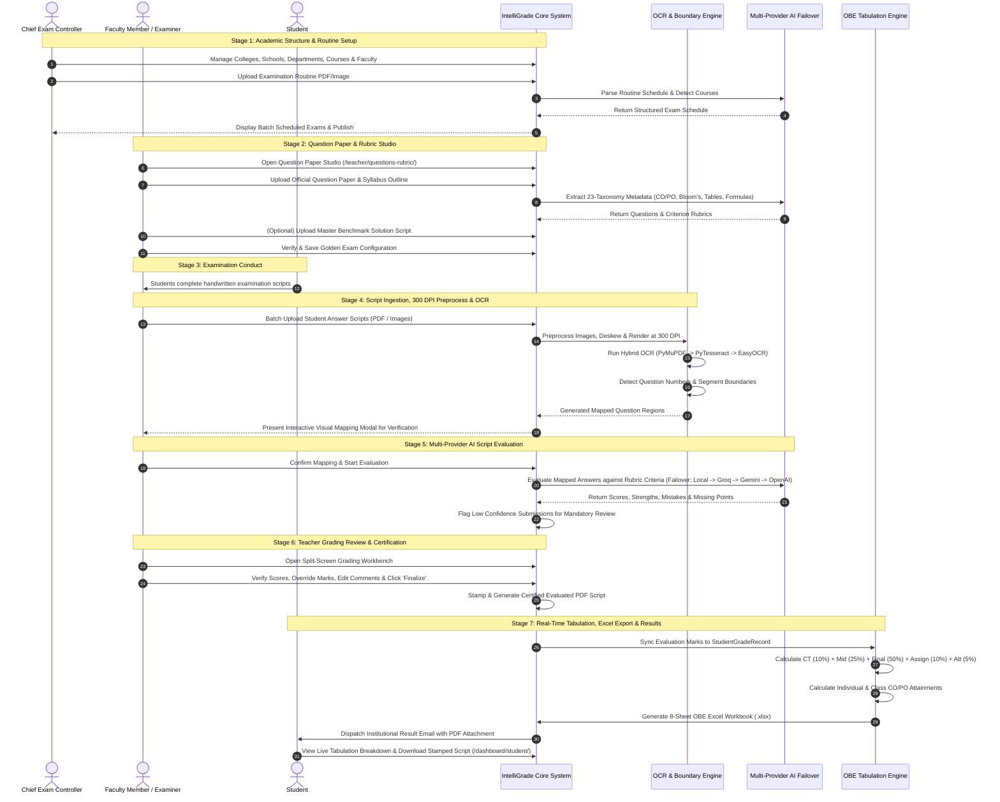
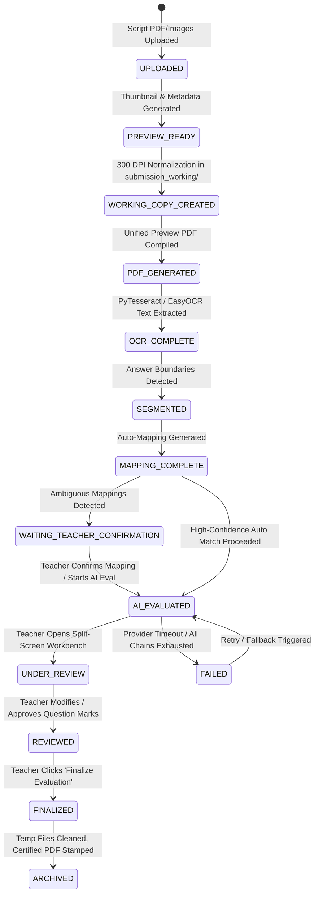
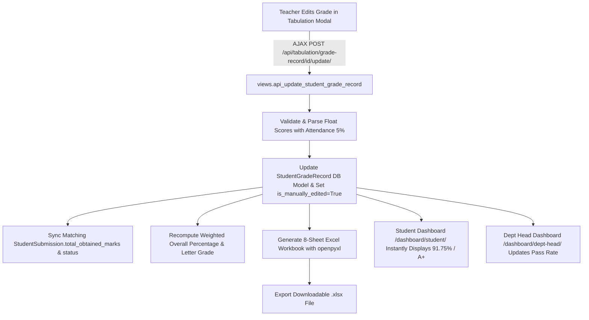

# IntelliGrade — End-to-End System Workflows & State Machines

**Document Version:** 3.5.0 (Enterprise Academic Edition)  
**Last Updated:** August 29, 2026  
**Auditor:** Principal Enterprise Systems Architect  

---

## 1. High-Level University Examination Lifecycle Workflow

---

## 2. Granular State Machine Specifications

### 2.1 StudentSubmission Lifecycle State Machine

### 2.2 Question Mapping State Machine
- **AUTO_HIGH**: Full regex match found at line beginning (e.g. `Question 1: Explain...`, `Ans to Q.1`), confidence $\ge 85\%$.
- **AMBIGUOUS**: Substring match or overlapping page boundaries detected, confidence $< 85\%$. Triggers teacher confirmation modal before AI grading.
- **MANUAL_OVERRIDE**: Teacher visually modifies bounding boxes or page numbers via the interactive crop tool.

### 2.3 EvaluationResult Review State Machine
- **PENDING**: AI evaluation completed, awaiting instructor inspection.
- **APPROVED**: Instructor verified and accepted AI-awarded scores without alteration.
- **OVERRIDDEN**: Instructor adjusted numerical marks or modified criteria feedback. Logs entry in `TeacherReview` and `EvaluationHistory`.
- **REJECTED**: Instructor marked evaluation invalid and requested targeted AI re-evaluation.

---

## 3. Real-Time OBE Tabulation Synchronization Flow

