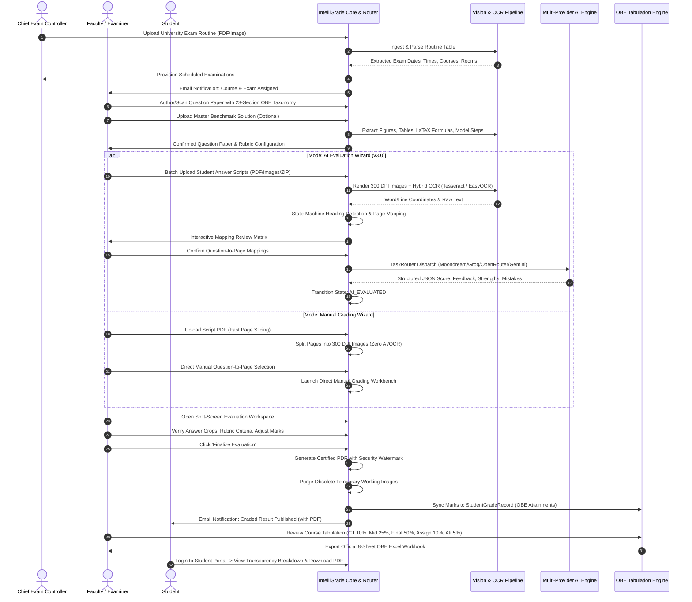
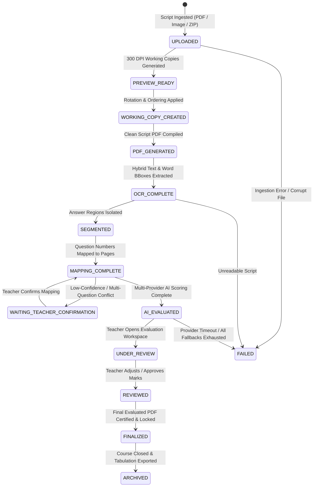

# IntelliGrade — End-to-End System Workflow & State Machine

**Document Version:** 4.0.0 (Enterprise Academic Release)  
**Last Updated:** August 30, 2026  
**Auditor:** Principal Enterprise Systems Architect  

---

## 1. Global End-to-End Process Workflow

---

## 2. Detailed State-Machine Lifecycle of `StudentSubmission`

The `StudentSubmission` entity progresses through a strictly validated state machine managed by `core/ai_engine/services/workflow.py`:

### State Definitions & Trigger Events:

1. **`UPLOADED`**: Script file received via API (`upload_student_submission`, `api_upload_raw_images`, `api_wizard_upload_pdf`).
2. **`PREVIEW_READY`**: Pages rendered to 300 DPI high-resolution working copies in `media/submission_working/`.
3. **`WORKING_COPY_CREATED`**: Page orientation angles (0°, 90°, 180°, 270°) and sequence orders normalized.
4. **`PDF_GENERATED`**: Clean composite answer script PDF generated in `media/submission_preview/`.
5. **`OCR_COMPLETE`**: Text extracted via PyMuPDF font parser, PyTesseract, or EasyOCR deep learning backend.
6. **`SEGMENTED`**: Visual bounding box coordinates (`[ymin, xmin, ymax, xmax]`) generated for distinct answer regions.
7. **`MAPPING_COMPLETE`**: Each exam question mapped to corresponding answer pages.
8. **`WAITING_TEACHER_CONFIRMATION`**: Flagged if question headers are missing, duplicated, or below 75% confidence.
9. **`AI_EVALUATED`**: Multi-provider AI completes partial-credit scoring, feedback generation, and rubric matching.
10. **`UNDER_REVIEW`**: Teacher actively inspecting script in split-screen Evaluation Workspace.
11. **`REVIEWED`**: Teacher completes manual score overrides and saves verified criteria marks.
12. **`FINALIZED`**: Final watermarked PDF generated in `media/submission_final/`, temporary working drafts purged, and marks synced to OBE Course Tabulation.
13. **`ARCHIVED`**: Grade records locked and exported for accreditation audits.
14. **`FAILED`**: Error state with detailed diagnostics recorded in `EvaluationAuditLog`.
