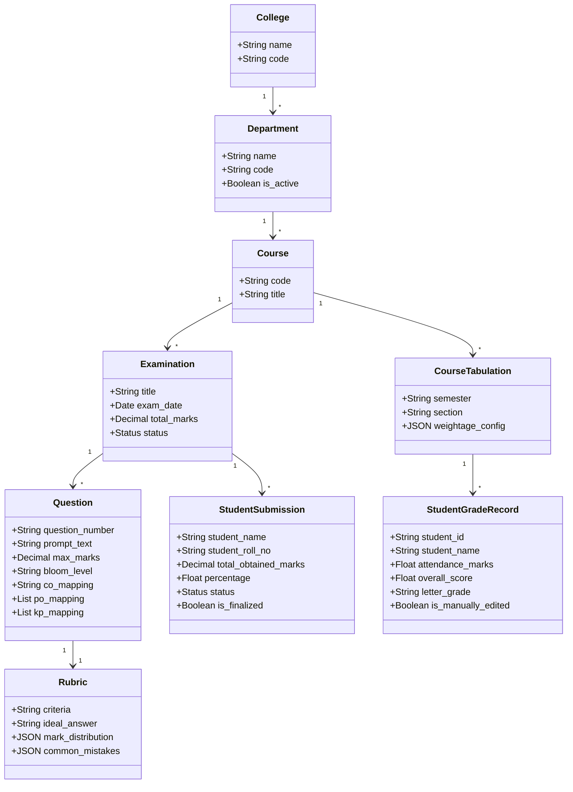

# IntelliGrade — Comprehensive Requirement Analysis

**Document Version:** 4.0.0 (Enterprise Academic Release)  
**Last Updated:** August 30, 2026  
**Auditor:** Principal Enterprise Systems Architect  

---

## 1. Domain Modeling & Stakeholder Needs Analysis

IntelliGrade addresses the complex institutional domain of university examination management and Outcome-Based Education (OBE) accreditation.

---

## 2. Stakeholder Need vs. System Capability Mapping

| Stakeholder Role | Core Academic Need | Architectural Capability Delivered |
| :--- | :--- | :--- |
| **Chief Exam Controller** | Centralized governance of university academic hierarchy and semester exam schedules. | Administrative CRUD portal with multi-page AI exam routine parser and 0ms local course matcher. |
| **Department Head** | Real-time visibility into department-level pass rates, teacher grading progress, and accreditation compliance. | Dedicated Department Head dashboard with live pass rate analytics, course tabulation review, and faculty oversight. |
| **Faculty / Examiner** | Rapid, consistent script evaluation without manual calculation errors; full control over final marks. | Split-screen grading workbench with dual wizards (AI v3.0 and Direct Manual), criterion scoring, manual override, and 8-sheet OBE Excel export. |
| **Student** | Transparent, timely evaluation feedback; detailed breakdown of mistakes; certified scripts for review. | Self-service student portal with real-time grade cards, question-by-question feedback, and certified watermarked PDF downloads. |

---

## 3. High-Priority Functional Requirement Clusters

1. **Academic Governance & Security**: Multi-tier institutional hierarchy with strict RBAC decorators, Argon2 password hashing, and session management.
2. **AI Multimodal Ingestion**: High-resolution 300 DPI PDF rendering, hybrid OCR (PyMuPDF $\rightarrow$ PyTesseract $\rightarrow$ EasyOCR on PyTorch CPU), and LaTeX formula sanitation.
3. **OBE Taxonomy & Accreditation**: Complete 23-section IUBAT metadata (CO1–CO6, PO1–PO12, Bloom's levels, KP/CEP/CEA engineering tags).
4. **Dual Evaluation Pipelines**: Automated AI Evaluation Wizard (v3.0) and 100% Direct Manual Grading Wizard with zero AI/OCR interference.
5. **Resilient AI Evaluation Pipeline**: Multi-provider failover orchestrator with TaskRouter, 429 rate limit cooldown registries, Local Moondream (800px LANCZOS JPEG quality 75), and JSON schema repair.
6. **Human-in-the-Loop Verification**: Split-screen grading workbench with eager-loaded relations (N+1 query elimination) and immutable audit logging (`TeacherReview`, `EvaluationHistory`, `EvaluationAuditLog`).
7. **Real-Time Bi-Directional OBE Tabulation**: Dynamic calculation of Class Test (10%), Midterm (25%), Final Exam (50%), Assignment (10%), and Attendance (5%), synchronized in real-time between Web UI, Database, Excel, and Student Portals.
8. **Automated Finalization Cleanup**: Automatic purging of temporary working image copies (`media/submission_working/`) upon final evaluated PDF generation.
