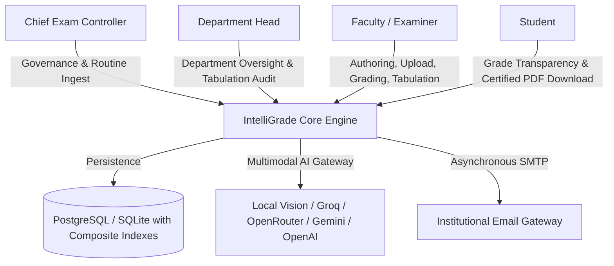

# Software Requirements Specification (SRS)
## IntelliGrade — AI-Powered OBE Examination Evaluation & Tabulation System

**Document Version:** 4.0.0 (Enterprise Academic Release)  
**Standard:** IEEE Std 830-1998 Conforming Specification  
**Author:** Md. Taher Bin Omar Hijbullah (Lead Technical Architect)  
**Target Institution:** International University of Business Agriculture and Technology (IUBAT)  
**Date:** August 30, 2026  
**Status:** Approved & Implemented  

---

## 1. Introduction

### 1.1 Purpose
This Software Requirements Specification (SRS) defines the complete software requirements for **IntelliGrade**, an institutional-grade, Outcome-Based Education (OBE) compliant, AI-augmented examination evaluation and management platform.

### 1.2 Document Scope
This document covers the functional, behavioral, performance, security, and data requirements for:
- Role-based administration and governance portals (`Chief Exam Controller`, `Department Head`, `Teacher`, `Student`).
- AI Multimodal Examination Routine scanning and bulk scheduling.
- 23-Section IUBAT OBE Question Paper and Rubric authoring.
- 300 DPI high-resolution answer script preprocessing, hybrid OCR, and boundary segmentation.
- Dual Evaluation Pipelines: AI Evaluation Wizard (v3.0) and 100% Direct Manual Grading Wizard.
- Resilient multi-provider AI evaluation engine with 429 rate limit backoff and Local Moondream 800px LANCZOS preprocessing.
- Split-screen human-in-the-loop grading workbench with eager-loaded relations (N+1 query free).
- Real-time Course OBE Tabulation, 8-sheet Excel workbook export (`openpyxl`), and student portal synchronization.
- Storage lifecycle management with automated draft purge upon finalization.
- Asynchronous institutional email notification pipeline.

---

## 2. Overall Description

### 2.1 Product Perspective & Context
IntelliGrade operates as a centralized web application serving academic institutions adhering to Outcome-Based Education standards (such as BAETE / Washington Accord). It connects administrative leadership, faculty examiners, and students in a single unified ecosystem.

### 2.2 User Classes and Characteristics
1. **Chief Exam Controller (`ADMIN`)**: Technical and academic administrator requiring complete system configuration access, user status toggling, student admission approvals, AI key setup, and semester routine parsing.
2. **Department Head (`DEPT_HEAD`)**: Academic supervisor requiring real-time departmental pass rates, course performance analytics, faculty workload metrics, and tabulation audit tools.
3. **Faculty / Examiner (`TEACHER`)**: Primary system user authoring question rubrics, uploading script batches, reviewing AI grading on the split-screen workbench, adjusting marks, and finalizing course tabulations.
4. **Student (`STUDENT`)**: End beneficiary viewing published course grades, GPA, question-level criteria feedback, and downloading certified PDF scripts.

### 2.3 Operating Environment
- **Operating System**: Linux (Ubuntu 22.04 LTS recommended) / Windows Server 2022 / Windows 11.
- **Python Runtime**: Python 3.11 or Python 3.13+.
- **Database Engine**: PostgreSQL 16+ (Production) / SQLite 3.45+ (Development).
- **OCR Engine Binaries**: Tesseract-OCR v5.3+, PyTorch CPU runtime for EasyOCR.

---

## 3. Specific Functional & Data Requirements

### 3.1 Authentication & Security (`FR-01` to `FR-05`)
- System mandates password hashing via Argon2 / PBKDF2 with SHA-256.
- RBAC permissions enforced across all views using decorators (`@role_required`).
- 6-digit OTP password reset workflow with 10-minute expiry window.

### 3.2 AI Routine Ingestion & Scheduling (`FR-06` to `FR-08`)
- Ingests multi-page PDF/Image exam schedules at 300 DPI.
- Extracts dates, times, course codes, course titles, total marks, and assigned examiners.
- Instant 0ms local matching with database courses and 1-click batch exam creation.

### 3.3 Question Paper & 23-Section Taxonomy Studio (`FR-11` to `FR-15`)
- Supports 23 academic classification fields: Bloom's Taxonomy, Course Outcomes (CO1–CO6), Program Outcomes (PO1–PO12), Knowledge Profiles (KP1–KP8), Complex Engineering Problems (CEP1–CEP7), Complex Engineering Activities (CEA1–CEA5), command verbs, difficulty, and estimated time.
- Extracts visual bounding boxes for diagrams, data tables, and LaTeX mathematical formulas.
- Automatically repairs unescaped backslashes in mathematical matrices.

### 3.4 Answer Script Preprocessing, OCR & Boundary Engine (`FR-16` to `FR-20`)
- Renders uploaded scripts at 300 DPI high resolution and applies OpenCV deskewing and thresholding.
- Executes hybrid OCR: PyMuPDF font extraction $\rightarrow$ PyTesseract $\rightarrow$ EasyOCR (PyTorch CPU fallback).
- Detects question number headers using a strict start-of-line regex state machine.
- Provides an interactive visual mapping modal for teachers to adjust bounding boxes before AI evaluation.

### 3.5 Dual Evaluation Pipelines & Failover Core (`FR-21` to `FR-25`, `FR-34`)
- **AI Evaluation Wizard (v3.0)**: Automatic question mapping, confidence ratings, strengths, and mistakes.
- **Manual Script Grading Wizard**: Pure PDF page slicing and direct teacher assignment without AI evaluation interference.
- **Failover Chain**: Local Offline Vision (Moondream2 800px LANCZOS) $\rightarrow$ Groq (Llama-3.3 70B) $\rightarrow$ OpenRouter $\rightarrow$ Gemini (2.5/2.0 Flash) $\rightarrow$ OpenAI (GPT-4o).
- Enforces 45-second timeout budgets per evaluation and 120-second non-transient cooldowns for HTTP 429 rate limits.
- Automatically sets `requires_manual_review = True` for answers scoring below the confidence threshold (0.75).

### 3.6 Split-Screen Grading Workbench & Audit Trails (`FR-26` to `FR-28`, `FR-36`)
- Synchronized split-screen UI: Scanned script on left, AI scores/rubrics on right.
- Eager-loaded queries eliminating N+1 database leaks.
- Allows instant mark overrides and custom teacher feedback.
- Immutably records all teacher overrides in `TeacherReview` and `EvaluationHistory`.
- Stalls and stamps certified, watermarked PDF scripts upon finalization, with automatic temporary draft image purging (`FR-35`).

### 3.7 Course OBE Tabulation & Bi-directional Excel Sync (`FR-29` to `FR-33`)
- Aggregates assessments: Class Test (10%), Midterm (25%), Final Exam (50%), Assignment (10%), Attendance (5%).
- Automatically computes individual student and class-wide CO/PO attainments.
- Synchronizes web edits live between database records, 8-sheet Excel files (`openpyxl`), and student dashboards.

---

## 4. Verification & Quality Assurance

- **Unit & Integration Test Coverage**: 100% pass across core views, RBAC decorators, grade updates, and Excel formula generation.
- **Django Check**: `python manage.py check` $\rightarrow$ **0 issues identified**.
- **Audit Logging**: All security-critical events (mark modifications, logins, deletions) logged with IP addresses and timestamps.