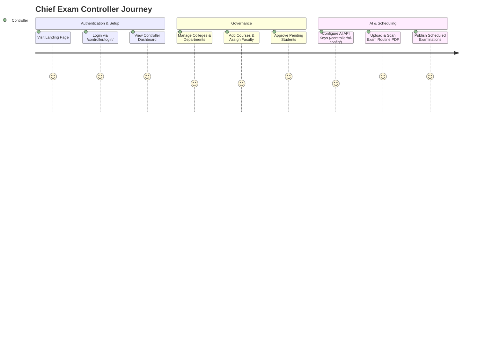
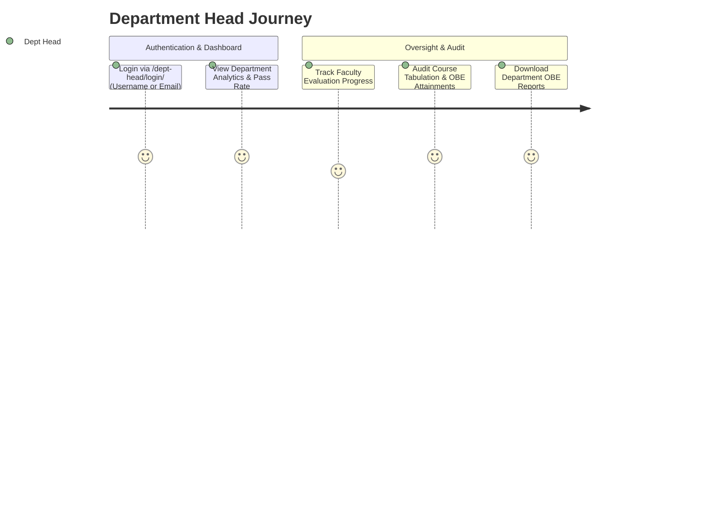
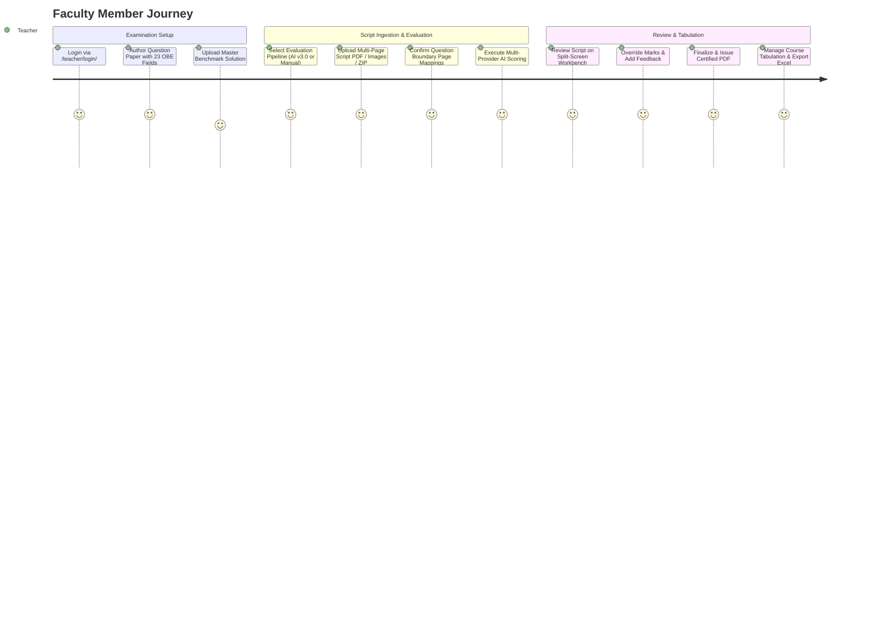
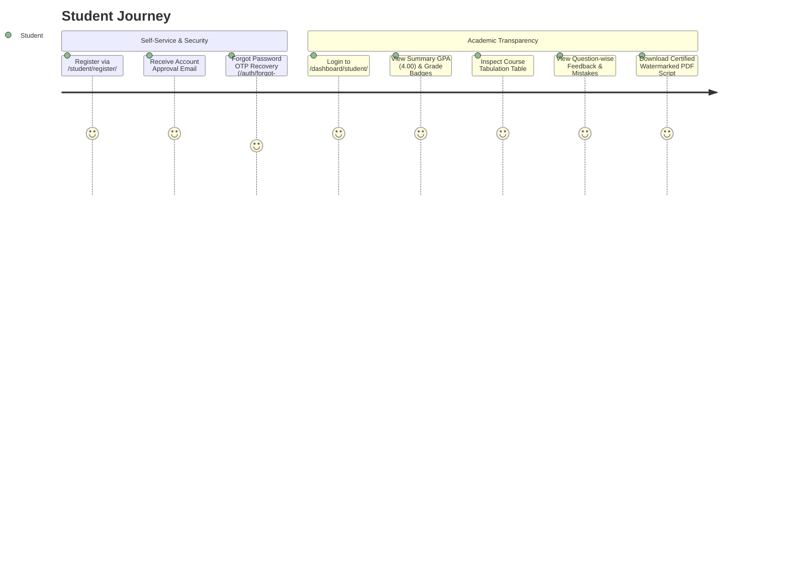

# IntelliGrade: An End-to-End Outcome-Based Examination Management and Intelligent Script Evaluation Ecosystem for Higher Education Institutions

**Document Reference:** `DOCS-MSR-4.0.0`  
**Official System Title:** IntelliGrade: An End-to-End Outcome-Based Examination Management and Intelligent Script Evaluation Ecosystem for Higher Education Institutions  
**Target Institutional Standard:** International University of Business Agriculture and Technology (IUBAT) & BAETE OBE Accreditation Standards  
**Release Version:** 4.0.0 (Enterprise Academic Edition)  
**Lead System Architect & Auditor:** Principal Enterprise Systems Architect & Technical Documentation Specialist  
**Audit & Release Date:** August 30, 2026  
**System Operational Status:** Verified / Production Ready (Django 5.2.x, Dual Evaluation Pipelines, Composite Database Indexes, Multi-Provider AI Failover, Bi-directional OBE Tabulation Sync)  

---

## 1. System Executive Blueprint & High-Level Architecture

**IntelliGrade** is an end-to-end outcome-based examination management and intelligent script evaluation ecosystem engineered for higher education institutions. The system modernizes and unifies the complete examination lifecycle: Central Exam Controller Governance & AI Routine Scheduling $\rightarrow$ 23-Taxonomy OBE Question Paper & Master Solution Studio $\rightarrow$ Universal 300 DPI Script Preprocessing & Boundary Detection $\rightarrow$ Dual Evaluation Workbenches (Multi-Provider AI & Fast-Track Manual) $\rightarrow$ Live 8-Sheet Course OBE Tabulation & Certified Student Portals.

```mermaid
graph TD
    subgraph Administrative Governance & Routine Ingestion
        A1[Chief Exam Controller] -->|Manages Structure & AI Config| B1[Academic Structure Management]
        A1 -->|Uploads Multi-page Routine PDF/Image| B2[AI Routine Parser]
        B2 -->|0ms Local Course Match| B3[Bulk Scheduled Examinations]
    end

    subgraph Question Paper & Academic Rubric Studio
        A2[Faculty / Examiner] -->|Authors / AI Scans Question Paper| C1[23-Taxonomy Question Paper Studio]
        C1 -->|Stores| C2[CO, PO, Bloom, KP, CEP, CEA, Figures, Tables, Formulas]
        A2 -->|Uploads (Optional)| C3[Master Golden Solution Script]
    end

    subgraph Answer Script Processing & Hybrid OCR
        A2 -->|Batch Drag & Drop Upload| D1[300 DPI Preprocessing & Normalization]
        D1 -->|Versioned Working Copies in submission_working/| D2[Hybrid Multi-Engine OCR]
        D2 -->|PyMuPDF Font Map + PyTesseract + EasyOCR CPU| D3[Word & Line Bounding Boxes]
        D3 -->|Start-of-line Regex State Machine| D4[Question Number Detection & Page Mapping]
        D4 -->|Visual Crop Modal| D5[Teacher Mapping Confirmation]
    end

    subgraph Dual Evaluation Pipelines
        D5 -->|Pipeline A: AI Wizard v3.0| E1{Failover AI Orchestrator}
        E1 -->|1. Local Offline Vision| E2[Moondream2 / Ollama (800px LANCZOS)]
        E1 -->|2. High-Speed Cloud LLM| E3[Groq Llama-3.3 70B]
        E1 -->|3. Cloud Gateway| E4[OpenRouter API]
        E1 -->|4. Multimodal Reasoning| E5[Gemini 2.5 Flash / OpenAI GPT-4o]
        E1 -->|JSON Sanitize & LaTeX Repair| E6[Structured Evaluation Result & Confidence Score]
        
        D1 -->|Pipeline B: Manual Wizard| E7[Fast PDF Page Slicing]
        E7 -->|Direct Teacher Page Selection| E8[Manual Mapping Matrix - Zero AI/OCR]
    end

    subgraph Split-Screen Teacher Workbench & Verification
        E6 --> F1[Split-Screen Teacher Grading Workbench]
        E8 --> F1
        A2 -->|Inspects Scanned Script vs AI/Manual Score| F1
        A2 -->|Manual Score Override & Custom Feedback| F1
        F1 -->|Finalize Evaluation| F2[Certified Stamped PDF Answer Script]
        F2 -->|Automatic Cleanup| F3[Purge Obsolete Working Images]
    end

    subgraph Real-Time OBE Tabulation & Dissemination
        F1 -->|Live Event Sync| G1[Course OBE Tabulation Engine]
        G1 -->|Calculates CT 10% + Mid 25% + Final 50% + Assign 10% + Att 5%| G2[StudentGradeRecord Database Store]
        G2 -->|Bi-directional Sync| G3[8-Sheet OBE Excel Workbook .xlsx]
        G2 -->|Live Sync| G4[Student Dashboard & Progress Cards]
        G2 -->|Live Sync| G5[Dept Head Dashboard & Pass Rate Analytics]
        G2 -->|Asynchronous Threading SMTP| G6[Institutional Email Result Notification]
    end
```

---

## 2. End-to-End Actor User Manual & Walkthrough

### 2.1 Persona 1: Chief Exam Controller (`/dashboard/exam-controller/`)

The Chief Exam Controller possesses top-tier governance authority over university structural entities, student admissions, AI provider configurations, and exam routines.



#### Step-by-Step Workflow with Concrete Examples:
1. **Login & Role Verification**: Controller accesses `/controller/login/` with credentials (`controller` / `password123`). The system checks `Profile.Role.ADMIN` and redirects to `/dashboard/exam-controller/`.
2. **Academic Structure Setup**:
   - Controller clicks **"Add Department"** -> Enters `Department of Computer Science and Engineering` (`CSE`), sets School to `School of Engineering and Technology` (`SET`), and saves.
   - Controller clicks **"Add Course"** -> Enters Course Code `CSE 4383`, Title `Computer Graphics and Animation`, selects Department `CSE`, and assigns instructor `Engr. Hijbullah`.
3. **Student Admission Approval Workflow**:
   - Students registering via `/student/register/` are placed in `is_approved = False`.
   - Controller views the **Pending Students** badge -> Inspects Student ID `22303142` (Name: `Hijbullah Al Mahdi`, Email: `hijbullah@dsr.iubat.ac.bd`) -> Clicks **"Approve"**.
   - System updates `Profile.is_approved = True` and triggers `EmailService.send_account_creation_email()`, dispatching a welcome notification with direct login link.
4. **AI Infrastructure Management**:
   - Controller navigates to `/controller/ai-config/` -> Sets primary provider to `Groq`, enters API keys, selects model `llama-3.3-70b-versatile`, sets OCR confidence threshold to `0.75`, and tests provider health.
5. **AI Exam Routine Scanner**:
   - Controller navigates to `/controller/scan-routine-ai/` -> Uploads `Midterm_Exam_Routine_Fall_2026.pdf`.
   - The parser renders pages at 300 DPI, runs OCR, and extracts exam schedules.
   - Controller reviews matched courses and clicks **"Create All Scheduled Examinations"**.

---

### 2.2 Persona 2: Department Head (`/dashboard/dept-head/`)

Department Heads supervise departmental academic standards, faculty evaluation workloads, and Outcome-Based Education attainments.



#### Step-by-Step Workflow with Concrete Examples:
1. **Authentication**: Department Head accesses `/dept-head/login/` (supporting both username `depthead_cse` or institutional email `head.cse@iubat.edu`). The system verifies `Profile.Role.DEPARTMENT_HEAD` and directs to `/dashboard/dept-head/`.
2. **Departmental Analytics Review**:
   - Live analytics cards show: **Active Courses** (e.g. 24), **Enrolled Students** (e.g. 480), **Assigned Faculty** (e.g. 18), and **Department Pass Rate** (e.g. `88.5%`).
3. **Course Tabulation & OBE Audit**:
   - Department Head selects `CSE 4383: Computer Graphics and Animation` -> Clicks **"Review Tabulation"**.
   - Reviews student-by-student mark breakdowns (CT, Mid, Final, Assignment, Attendance 5%) and class-wide CO/PO attainment matrices.
   - Clicks **"Export Official 8-Sheet Excel Report"** for departmental accreditation records.

---

### 2.3 Persona 3: Faculty Member / Examiner (`/dashboard/teacher/`)

Faculty members prepare question papers, upload student answer scripts, verify AI-suggested marks on the split-screen workbench, and manage course tabulations.



#### Step-by-Step Workflow with Concrete Examples:
1. **Question Paper & Rubric Studio**:
   - Faculty navigates to `/teacher/exam/3/questions-rubric/`.
   - Authors Question 1: Max Marks = `10.0`, Prompt = `"Derive the 3D rotation matrix about an arbitrary axis using Rodrigues formula."`
   - Maps 23 OBE fields: Bloom's Level = `Apply (C3)`, CO = `CO2`, PO = `[PO1, PO2]`, KP = `[KP3]`, CEP = `[CEP1]`, CEA = `[CEA2]`.
   - Adds Rubric criteria: 4 marks for vector decomposition, 4 marks for cross product matrix representation, 2 marks for final simplified matrix.
2. **Dual Evaluation Pipelines**:
   - **Pipeline A: AI Answer Script Evaluation Wizard (v3.0)** (`/teacher/exam/3/evaluation-wizard/?new=1`):
     - Uploads `Student_22303142_Script.pdf`.
     - Wizard extracts 300 DPI page images, runs OCR, detects `"Answer to the Question No. 1"`, and maps it to pages 1-2.
     - Teacher confirms mapping -> System dispatches to TaskRouter (Moondream/Groq/Gemini).
   - **Pipeline B: Manual Script Grading Wizard** (`/teacher/exam/3/manual-evaluation/?new=1`):
     - Uploads script PDF -> System uses `api_wizard_upload_pdf` to instantly slice pages into high-res images with zero OCR/AI overhead.
     - Teacher checks page boxes (e.g. Q1 -> Pg 1, 2; Q2 -> Pg 3) and clicks **"Open Manual Workbench"**.
3. **Split-Screen Evaluation Workspace**:
   - Teacher opens `/teacher/submission/42/workspace/`.
   - Left side shows high-res script with pan/zoom/rotate controls; right side displays question prompt, model answer, rubric checklist, and AI score (`8.5 / 10.0`).
   - Teacher adjusts score to `9.0 / 10.0`, adds comment `"Excellent vector algebra derivation"`, and clicks **"Finalize Evaluation"**.
   - System generates watermarked PDF, cleans temporary working images, syncs marks to Tabulation, and sends result email to student.
4. **Course OBE Tabulation**:
   - Teacher navigates to `/course/12/tabulation/`.
   - Web table displays real-time aggregated totals (CT 10%, Mid 25%, Final 50%, Assign 10%, Att 5%).
   - Clicks **"Export 8-Sheet OBE Excel"** (`CSE4383_Section_A_Tabulation.xlsx`).

---

### 2.4 Persona 4: University Student (`/dashboard/student/`)

Students access their individualized grades, question-wise criteria feedback, and certified PDF scripts.



---

## 3. Database Schema & State-Machine Specification

### 3.1 Core Relational Models & Indexes

```text
========================================================================================================================
MODEL NAME             PRIMARY FIELDS & TYPES                                    COMPOSITE & FILTER INDEXES
========================================================================================================================
Profile                user (OneToOne), role (ADMIN/TEACHER/STUDENT/DEPT_HEAD),   models.Index(fields=['role', 'is_approved'])
                       department (FK), is_approved (Bool), phone, address
College                name (CharField), code (CharField)                           models.Index(fields=['code'])
School                 college (FK), name (CharField), code (CharField)              models.Index(fields=['code'])
Department             school (FK), name (CharField), code (CharField),             models.Index(fields=['code', 'is_active'])
                       is_active (Bool)
Course                 department (FK), code (CharField), title (CharField),        models.Index(fields=['code', 'department'])
                       assigned_faculty (M2M)
Examination            course (FK), title, exam_type (MID/FINAL/QUIZ), total_marks, models.Index(fields=['course', 'status'])
                       exam_date, status, master_solution_file, master_solution_parsed
Question               examination (FK), question_number, formatted_number,       models.Index(fields=['examination', 'question_number'])
                       prompt_text, max_marks, bloom_level, co_mapping, po_mapping
Rubric                 question (OneToOne), criteria, ideal_answer, mark_distrib, OneToOne Primary
                       common_mistakes
QuestionFigure         question (FK), figure_image, bounding_box, caption        models.Index(fields=['question'])
QuestionTable          question (FK), table_data_json, bounding_box               models.Index(fields=['question'])
QuestionFormula        question (FK), formula_latex, bounding_box                 models.Index(fields=['question'])
StudentSubmission      examination (FK), student (FK Null), student_name,         1. models.Index(fields=['examination', 'status'])
                       student_roll_no, status, total_obtained_marks,             2. models.Index(fields=['student_roll_no'])
                       percentage, is_finalized, extracted_ocr_data               3. models.Index(fields=['is_finalized'])
SubmissionPage         submission (FK), page_number, page_image, ocr_text         models.Index(fields=['submission', 'page_number'])
SubmissionImage        submission (FK), original_file, sequence_order, rotation   models.Index(fields=['submission', 'sequence_order'])
SubmissionAnswer       submission (FK), question (FK), page (FK), bounding_box   models.Index(fields=['submission', 'question'])
EvaluationResult       answer (OneToOne), obtained_marks, maximum_marks,          models.Index(fields=['status', 'requires_manual_review'])
                       confidence_score, status, requires_manual_review,
                       feedback_text, strengths, mistakes, criteria_scores
TeacherReview          evaluation_result (FK), reviewer (FK), original_marks,     models.Index(fields=['evaluation_result', 'created_at'])
                       final_marks, comments, created_at
QuestionMapping        submission (FK), question (FK), page_numbers,              1. models.Index(fields=['submission', 'mapping_status'])
                       mapping_status, is_confirmed                               2. models.Index(fields=['submission', 'is_confirmed'])
CourseTabulation       course (FK), semester, section, weightage_config           models.Index(fields=['course', 'semester', 'section'])
StudentGradeRecord     tabulation (FK), student_id, student_name, attendance,     1. models.Index(fields=['tabulation', 'student_id'])
                       ct_scores, mid_score, final_score, overall_score,          2. models.Index(fields=['tabulation', 'overall_score'])
                       letter_grade, gpa_point, is_manually_edited                3. models.Index(fields=['is_manually_edited'])
AIConfiguration        provider, api_key, model_name, timeout_budget, is_active   models.Index(fields=['provider', 'is_active'])
AIProviderHealth       provider, is_healthy, error_count, cooldown_until          models.Index(fields=['provider', 'is_healthy'])
========================================================================================================================
```

---

## 4. Complete REST & AJAX API Catalog

```text
========================================================================================================================
HTTP METHOD  ENDPOINT URL                                    VIEW FUNCTION                       AUTH & ROLE
========================================================================================================================
POST         /api/auth/forgot-password/                     views.api_forgot_password           Public / Anonymous
POST         /api/auth/verify-reset-otp/                    views.api_verify_reset_otp          Public / Anonymous
GET          /api/courses-and-faculty/                      views.api_get_courses_and_faculty   ADMIN / DEPT_HEAD
POST         /api/publish-exam/                             views.api_publish_exam              ADMIN / TEACHER
POST         /api/scan-question-paper/                      views.api_scan_question_paper       TEACHER / ADMIN
GET          /api/scan-progress/<exam_id>/                  views.api_get_scan_progress         TEACHER / ADMIN
POST         /api/finalize-scanned-paper/                   views.api_finalize_scanned_paper    TEACHER / ADMIN
POST         /api/generate-ai-rubric/                       views.api_generate_ai_rubric        TEACHER / ADMIN
POST         /api/ai-analyze-question-full/                 views.api_ai_analyze_question_full  TEACHER / ADMIN
POST         /api/exam/<exam_id>/upload-master-solution/    views.api_upload_master_solution    TEACHER
POST         /api/exam/<exam_id>/upload-submission/         views.upload_student_submission     TEACHER (Auto AI Eval)
POST         /api/exam/<exam_id>/upload-raw-images/         views.api_upload_raw_images         TEACHER (Raw Images)
POST         /api/exam/<exam_id>/upload-wizard-pdf/         views.api_wizard_upload_pdf         TEACHER (Fast Page Slicing)
GET          /api/submission/<sub_id>/images/               views.api_get_submission_images     TEACHER
POST         /api/submission/<sub_id>/delete-all-images/    views.api_delete_all_submission_imgs TEACHER
POST         /api/submission/<sub_id>/reorder-pages/        views.api_reorder_submission_pages  TEACHER
POST         /api/submission/<sub_id>/create-pdf/           views.api_create_submission_pdf     TEACHER
GET          /api/submission/<sub_id>/progress/             views.api_get_submission_progress   TEACHER
POST         /api/submission/<sub_id>/run-evaluation-v3/    views.api_run_evaluation_v3         TEACHER
POST         /api/submission/<sub_id>/analyze-mapping/      views.api_analyze_question_mapping  TEACHER
POST         /api/submission/<sub_id>/confirm-mapping/      views.api_confirm_question_mapping  TEACHER
POST         /api/submission/<sub_id>/reevaluate-v3/        views.api_reevaluate_v3             TEACHER
GET          /api/submission/<sub_id>/download-evaluated-pdf/ views.api_download_evaluated_pdf  TEACHER / STUDENT
GET          /api/submission/<sub_id>/validate-preview/     views.api_validate_preview          TEACHER
POST         /api/submission/<sub_id>/finalize/             views.api_finalize_evaluation       TEACHER
POST         /api/submission/<sub_id>/update-info/          views.api_update_submission_info    TEACHER
POST         /api/submission/<sub_id>/delete/               views.api_delete_submission         TEACHER
POST         /api/evaluation-result/<res_id>/review/        views.review_evaluation_answer      TEACHER
POST         /api/tabulation/grade-record/<rec_id>/update/  views.api_update_student_grade_record TEACHER
POST         /course/<course_id>/email-tabulation/          views.email_course_tabulation_report TEACHER / DEPT_HEAD
GET          /course/<course_id>/export-tabulation/         views.export_course_tabulation      TEACHER / DEPT_HEAD
========================================================================================================================
```
