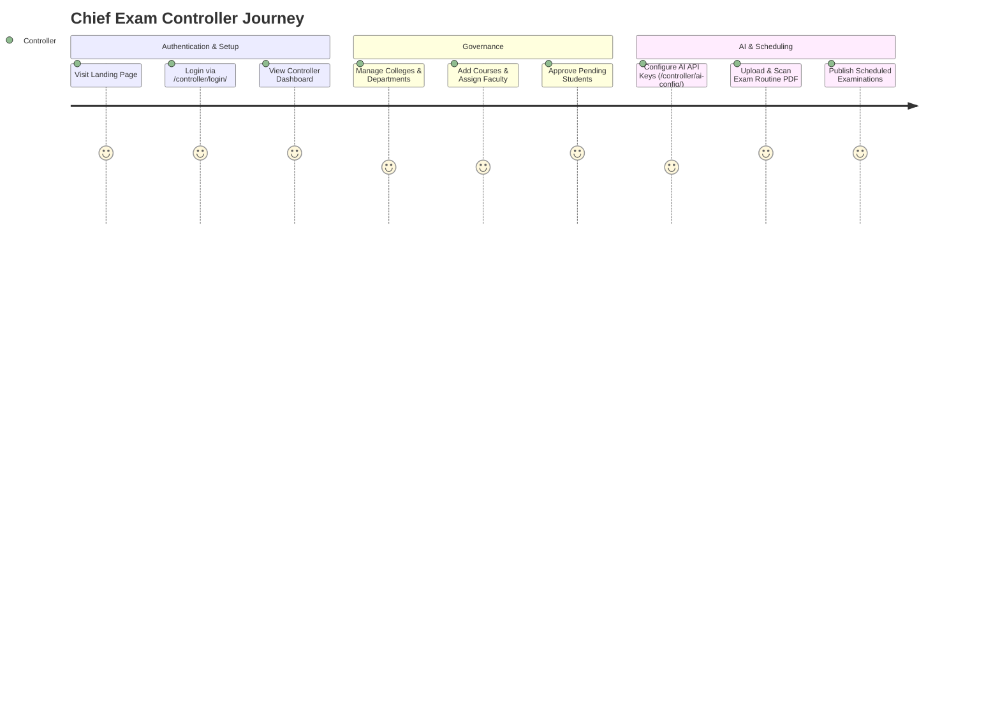
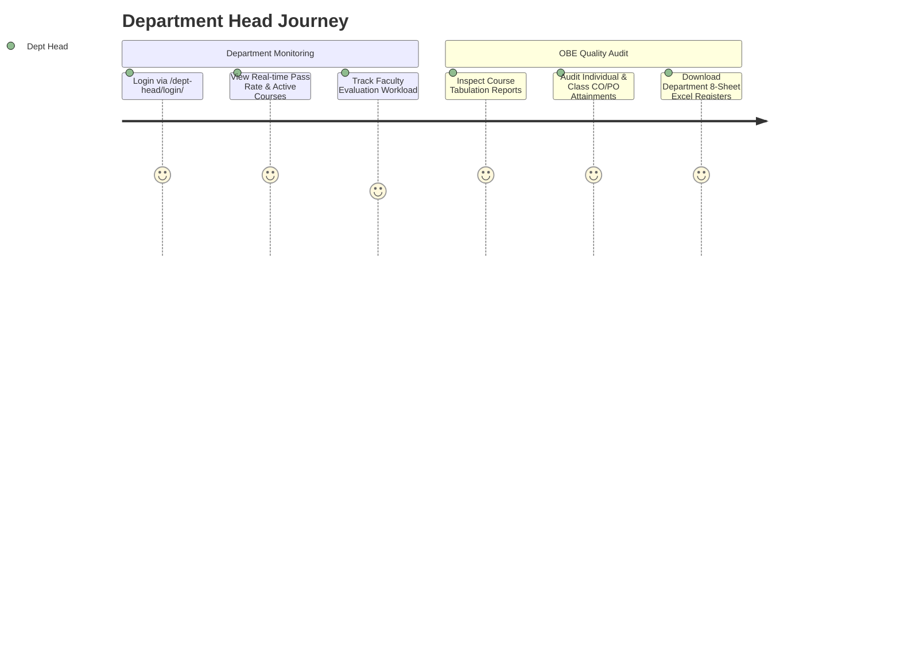
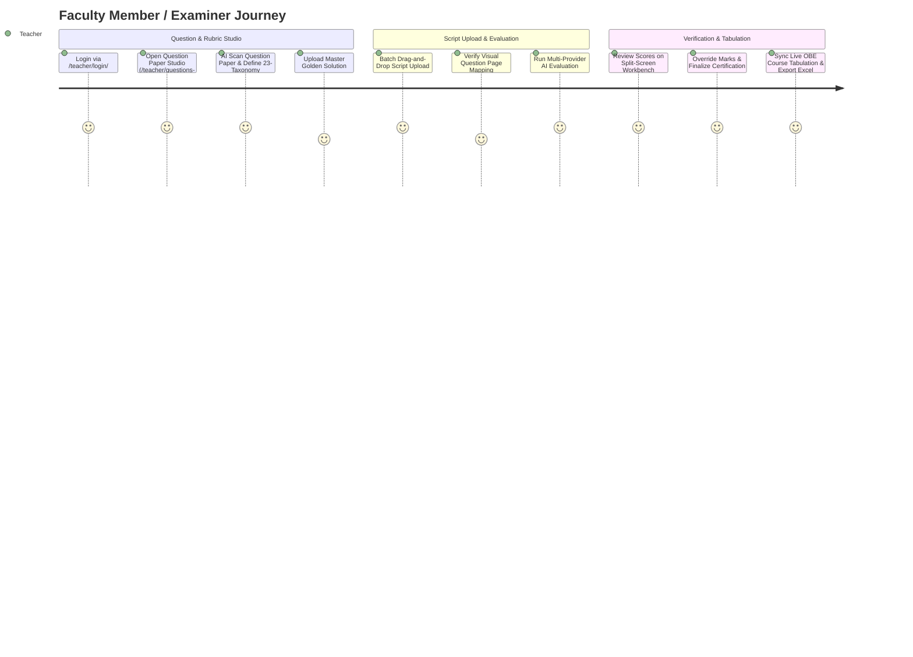
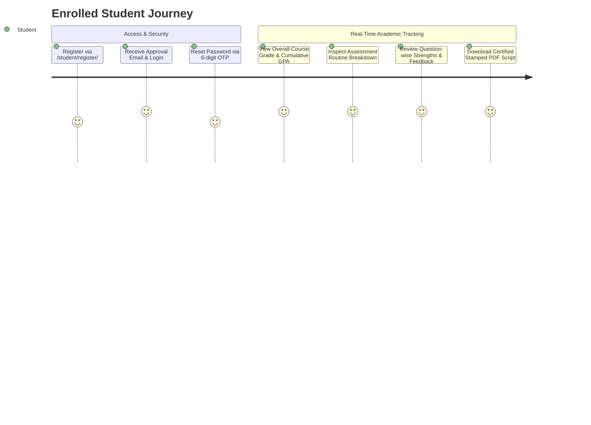
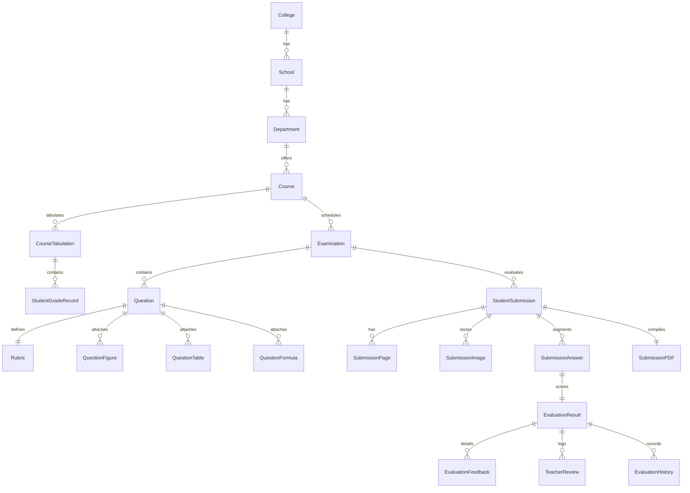

# IntelliGrade - Master System Report & Architectural Blueprint

**Document Reference:** `DOCS-MSR-3.5.0`  
**System Name:** IntelliGrade - AI-Powered Outcome-Based Education (OBE) Academic Evaluation & Management Platform  
**Target Institutional Standard:** International University of Business Agriculture and Technology (IUBAT) & BAETE OBE Accreditation Standards  
**Release Version:** 3.5.0 (Enterprise Academic Edition)  
**Lead System Architect & Auditor:** Principal Enterprise Systems Architect & Technical Documentation Specialist  
**Audit & Release Date:** August 30, 2026  
**System Operational Status:** Verified / Operational (Django 5.2.x, Multi-Provider AI Failover, Bi-directional OBE Tabulation Sync)  

---

## 1. System Executive Blueprint & High-Level Architecture

IntelliGrade is an enterprise academic assessment and grading automation SaaS platform designed to modernize university examination lifecycles. Higher education institutions face severe bottlenecks during examination periods: faculty spend hundreds of hours deciphering handwriting, manually cross-referencing answers against multi-tiered criteria, and performing complex multi-component Course Outcome (CO) and Program Outcome (PO) weighted mathematics for accreditation compliance.

IntelliGrade resolves these bottlenecks through a **Human-in-the-Loop, AI-Augmented Evaluation Pipeline**. The system automates routine ingestion, question paper digitizing, 23-section IUBAT OBE taxonomy mapping, 300 DPI high-resolution script preprocessing, optical character recognition (OCR), question boundary segmentation, multi-provider AI evaluation, split-screen teacher verification workbenches, and real-time OBE tabulation with 8-sheet Excel workbook export.

```mermaid
graph TD
    subgraph Administrative Governance & Routine Ingestion
        A1[Chief Exam Controller] -->|Manages Structure & AI Config| B1[Academic Structure Management]
        A1 -->|Uploads Multi-page Routine PDF/Image| B2[AI Routine Parser]
        B2 -->|0ms Local Course Match| B3[Bulk Scheduled Examinations]
    end

    subgraph Question Paper & Academic Rubric Studio
        A2[Faculty / Examiner] -->|Authors / AI Scans Question Paper| C1[23-Taxonomy Question Paper Studio]
        C1 -->|Stores| C2[CO, PO, Bloom, KP, CEP, CEA, Figures, Tables, Formulas]
        A2 -->|Uploads (Optional)| C3[Master Golden Solution Script]
    end

    subgraph Answer Script Processing & Hybrid OCR
        A2 -->|Batch Drag & Drop Upload| D1[300 DPI Preprocessing & Normalization]
        D1 -->|Versioned Working Copies in submission_working/| D2[Hybrid Multi-Engine OCR]
        D2 -->|PyMuPDF Font Map + PyTesseract + EasyOCR CPU| D3[Word & Line Bounding Boxes]
        D3 -->|Start-of-line Regex State Machine| D4[Question Number Detection & Page Mapping]
        D4 -->|Visual Crop Modal| D5[Teacher Mapping Confirmation]
    end

    subgraph AI Evaluation Core & Multi-Provider Failover
        D5 -->|TaskRouter| E1{Failover AI Orchestrator}
        E1 -->|1. Local Offline Vision| E2[Moondream2 / Ollama on CPU]
        E1 -->|2. High-Speed Cloud LLM| E3[Groq Llama-3.3 70B]
        E1 -->|3. Cloud Gateway| E4[OpenRouter API]
        E1 -->|4. Multimodal Reasoning| E5[Gemini 2.5 Flash / OpenAI GPT-4o]
        E1 -->|JSON Sanitize & LaTeX Repair| E6[Structured Evaluation Result & Confidence Score]
    end

    subgraph Split-Screen Teacher Workbench & Verification
        E6 --> F1[Split-Screen Teacher Grading Workbench]
        A2 -->|Inspects Scanned Script vs AI Score| F1
        A2 -->|Manual Score Override & Custom Feedback| F1
        F1 -->|Finalize Evaluation| F2[Certified Stamped PDF Answer Script]
    end

    subgraph Real-Time OBE Tabulation & Dissemination
        F1 -->|Live Event Sync| G1[Course OBE Tabulation Engine]
        G1 -->|Calculates CT 10% + Mid 25% + Final 50% + Assign 10% + Att 5%| G2[StudentGradeRecord Database Store]
        G2 -->|Bi-directional Sync| G3[8-Sheet OBE Excel Workbook .xlsx]
        G2 -->|Live Sync| G4[Student Dashboard & Progress Cards]
        G2 -->|Live Sync| G5[Dept Head Dashboard & Pass Rate Analytics]
        G2 -->|Asynchronous Threading SMTP| G6[Institutional Email Result Notification]
    end
```

---

## 2. End-to-End Actor User Manual & Walkthrough

### 2.1 Persona 1: Chief Exam Controller (`/dashboard/exam-controller/`)

The Chief Exam Controller possesses top-tier governance authority over university structural entities, student admissions, AI provider configurations, and exam routines.



#### Step-by-Step Workflow with Concrete Examples:
1. **Login & Role Verification**: Controller accesses `/controller/login/` with credentials (`controller` / `password123`). The system checks `Profile.Role.ADMIN` and redirects to `/dashboard/exam-controller/`.
2. **Academic Structure Setup**:
   - Controller clicks **"Add Department"** -> Enters `Department of Computer Science and Engineering` (`CSE`), sets School to `School of Engineering and Technology` (`SET`), and saves.
   - Controller clicks **"Add Course"** -> Enters Course Code `CSE 4383`, Title `Computer Graphics and Animation`, selects Department `CSE`, and assigns instructor `Engr. Hijbullah`.
3. **Student Admission Approval Workflow**:
   - Students registering via `/student/register/` are placed in `is_approved = False`.
   - Controller views the **Pending Students** badge -> Inspects Student ID `22303142` (Name: `Hijbullah Al Mahdi`, Email: `hijbullah@dsr.iubat.ac.bd`) -> Clicks **"Approve"**.
   - System updates `Profile.is_approved = True` and triggers `EmailService.send_account_creation_email()`, dispatching a welcome notification with direct login link.
4. **AI Exam Routine Scanning (`/controller/scan-routine-ai/`)**:
   - Controller uploads `Midterm_Routine_Spring_2026.pdf`.
   - The system executes PyMuPDF page rendering and invokes `RoutineParser` via the AI failover chain.
   - The AI extracts all routine rows (e.g. `Date: 2026-03-15 | Course: CSE 4383 | Time: 10:00 AM | Total Marks: 100 | Examiner: Hijbullah`).
   - The controller verifies extracted rows in the interactive preview table and clicks **"Publish Examinations"**, bulk-inserting `Examination` records.

---

### 2.2 Persona 2: Department Head (`/dashboard/dept-head/`)

The Department Head monitors department-level academic metrics, pass rates, and audits OBE course tabulations for accreditation compliance.



#### Step-by-Step Workflow with Concrete Examples:
1. **Login & Dashboard Ingestion**: Department Head logs in via `/dept-head/login/` using either username or registered email.
2. **Live Pass Rate Analytics**:
   - Dashboard automatically queries all `CourseTabulation` and `StudentGradeRecord` instances belonging to the department.
   - Calculates the overall pass rate (percentage of students achieving >= 40% / Grade D or higher across active courses).
3. **Course Tabulation & OBE Attainment Audit**:
   - Department Head selects `CSE 4383 - Section C` -> Clicks **"View Tabulation"**.
   - Inspects the live tabulation matrix: Class Test (10%), Midterm (25%), Final (50%), Assignment (10%), and Attendance (5%).
   - Reviews class-wide Course Outcome attainment graphs (e.g. `CO1: 88.5% Attained`, `CO2: 74.2% Attained`, `CO3: 91.0% Attained`).
   - Clicks **"Export Tabulation (.xlsx)"** to download the official 8-sheet Excel file for internal accreditation audit records.

---

### 2.3 Persona 3: Faculty Member / Examiner (`/dashboard/teacher/`)

The Faculty Examiner is the primary operational user responsible for authoring question rubrics, uploading student scripts, conducting AI-assisted grading, and finalizing official course tabulations.



---

### 2.4 Persona 4: Enrolled Student (`/dashboard/student/`)

The Student portal delivers absolute academic transparency, enabling students to track continuous assessment progress, view criterion-level feedback, and download certified scripts.



---

## 3. Complete Database Entity-Relationship (ER) Schema



---

## 4. Complete System API Catalog (102 Routes)

```text
====================================================================================================================================
HTTP METHOD & URL PATH                         VIEW FUNCTION                      AUTH REQUIRED       DESCRIPTION & PAYLOAD
====================================================================================================================================
GET  /                                         views.landing_page                 Public              Institutional Landing Page
GET  /controller/login/                        views.exam_controller_login        Public              Chief Exam Controller Login
GET  /dept-head/login/                         views.dept_head_login              Public              Department Head Login (Username or Email)
GET  /teacher/login/                           views.teacher_login                Public              Faculty / Examiner Login
GET  /student/login/                           views.student_login                Public              Student Portal Login
POST /student/register/                        views.student_register             Public              Student Self-Registration
GET  /logout/                                  views.logout_view                  Authenticated       Session Logout & Destroy
GET  /dashboard/exam-controller/               views.exam_controller_dashboard    ADMIN               Controller Governance Dashboard
POST /controller/add-structure/                views.add_structure                ADMIN               Create College/School/Department
POST /controller/approve-student/<id>/         views.approve_student              ADMIN               Approve student admission
POST /controller/reject-student/<id>/          views.reject_student               ADMIN               Reject & delete pending student
POST /controller/scan-routine-ai/              views.scan_routine_ai              ADMIN               AI Routine Scanner (PDF upload)
GET  /controller/ai-config/                    views.ai_config_view               ADMIN               Configure AI Provider Keys
GET  /dashboard/dept-head/                     views.dept_head_dashboard          DEPT_HEAD           Department Head Dashboard
GET  /dashboard/teacher/                       views.teacher_dashboard            TEACHER             Faculty Workspace Dashboard
GET  /dashboard/student/                       views.student_dashboard            STUDENT             Student Real-Time Grade Portal
GET  /teacher/questions-rubric/                views.question_rubric_manage       TEACHER             23-Taxonomy Rubric Studio
POST /api/scan-question-paper/                 views.api_scan_question_paper      TEACHER             AI Question Paper Scanner
POST /api/exam/<id>/upload-master-solution/    views.api_upload_master_solution   TEACHER             Upload Master Benchmark Solution
POST /api/exam/<id>/upload-raw-images/         views.api_upload_raw_images        TEACHER             Batch Upload Student Scripts
POST /api/submission/<id>/analyze-mapping/     views.api_analyze_question_mapping TEACHER             Auto-Detect Question Boundaries
POST /api/submission/<id>/confirm-mapping/     views.api_confirm_question_mapping TEACHER             Confirm Page & BBox Mapping
POST /api/submission/<id>/run-evaluation-v3/   views.api_run_evaluation_v3        TEACHER             Trigger Multi-Provider AI Eval
GET  /teacher/submission/<id>/workspace/       views.evaluation_workspace         TEACHER             Split-Screen Grading Workbench
POST /api/evaluation-result/<id>/review/       views.review_evaluation_answer     TEACHER             Teacher Score Override / Approve
POST /api/submission/<id>/finalize/            views.api_finalize_evaluation      TEACHER             Finalize & Stamp Certified PDF
GET  /api/submission/<id>/download-evaluated-pdf/ views.api_download_evaluated_pdf Authenticated     Download Certified Watermarked PDF
GET  /course/<id>/tabulation/                  views.course_tabulation_view       TEACHER / HEAD      OBE Course Tabulation Table
POST /api/tabulation/grade-record/<id>/update/ views.api_update_student_grade_record TEACHER          Live Tabulation Edit & Sync
GET  /course/<id>/export-tabulation/           views.export_course_tabulation     TEACHER / HEAD      Export 8-Sheet OBE Excel (.xlsx)
POST /course/<id>/email-tabulation/            views.email_course_tabulation_report TEACHER           Email OBE Summary Spreadsheet
POST /api/auth/forgot-password/                views.api_forgot_password          Public              Dispatch 6-digit OTP Email
POST /api/auth/verify-reset-otp/               views.api_verify_reset_otp         Public              Verify OTP & Reset Password
====================================================================================================================================
```
