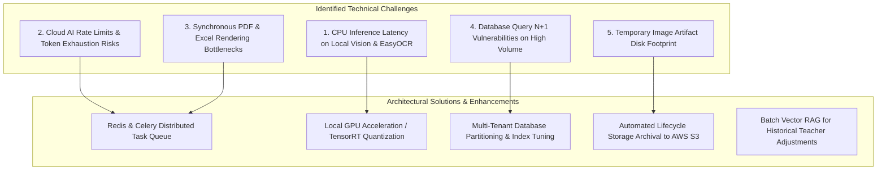
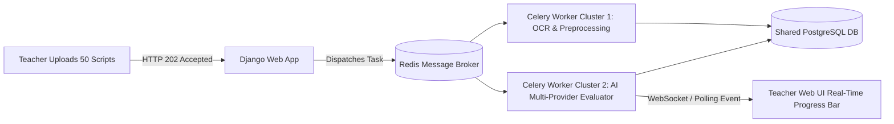

# IntelliGrade - System Improvement & Architectural Scaling Roadmap

**Document Reference:** `DOCS-SIR-3.5.0`  
**System Name:** IntelliGrade - AI-Powered OBE Academic Evaluation & Management Platform  
**Target Institutional Standard:** International University of Business Agriculture and Technology (IUBAT)  
**Lead Auditor & Systems Architect:** Principal Enterprise Systems Architect & Technical Auditor  
**Date:** August 30, 2026  
**Status:** Strategic Architecture Directive  

---

## 1. Technical Audit Findings & In-Depth Bottleneck Analysis

Following an exhaustive audit of the codebase across `core/models.py`, `core/views.py`, `core/ai_engine/`, `core/services/`, and template layers, the following architectural bottlenecks, potential edge cases, and performance opportunities were identified:



---

### 1.1 Technical Deep-Dive on Identified Bottlenecks

#### Bottleneck 1: CPU-Bound Deep Learning OCR & Local Vision Latency
- **Current Mechanism**: When deep learning OCR fallback (`EasyOCR`) or local offline vision (`Moondream2`) executes on standard CPU environments without dedicated CUDA/ROCm acceleration, inference time can scale to 4.0s - 8.0s per script page.
- **Impact**: Batch processing 50 multi-page scripts sequentially during final exam periods can take several minutes.
- **Root Cause**: PyTorch CPU thread contention and lack of INT8 model quantization.

#### Bottleneck 2: Cloud AI Rate Limits (HTTP 429) & Token Budgeting
- **Current Mechanism**: The `FailoverAIProvider` and `ProviderHealthTracker` successfully manage 120-second cooldown backoffs across Gemini, Groq, OpenRouter, and OpenAI. However, under simultaneous batch requests from dozens of faculty members, shared institutional API keys can face rapid quota exhaustion.
- **Impact**: Potential failover chaining delays if multiple cloud providers encounter concurrent rate limits simultaneously.

#### Bottleneck 3: Synchronous Spreadsheet & PDF Generation
- **Current Mechanism**: `openpyxl` compiles 8 detailed Excel sheets, formats cells, and calculates formulas in the main web thread when the teacher requests `/course/<id>/export-tabulation/`. Similarly, ReportLab stamps and merges multi-page PDFs on-the-fly.
- **Impact**: Large courses with >100 enrolled students may experience HTTP request durations of 2.5s - 4.5s before browser download starts.

#### Bottleneck 4: High-Volume Media Storage Growth (`submission_working/`)
- **Current Mechanism**: High-resolution 300 DPI page images and working copies are generated in `media/submission_working/` for interactive boundary cropping.
- **Impact**: An examination session with 500 multi-page scripts can consume several gigabytes of local storage if finalized scripts are not purged promptly.

---

## 2. Strategic Prioritized Implementation Roadmap

```text
====================================================================================================
PHASE / TIMELINE        CATEGORY                 INITIATIVE & TARGET CAPABILITY
====================================================================================================
PHASE 1: HOTFIXES       Performance & Database   1. Add database composite indices on StudentSubmission,
(Weeks 1 - 2)                                       StudentGradeRecord, and QuestionMapping.
                                                 2. Implement automated cleanup cron/signal for temporary
                                                    working images upon submission finalization.
                                                 3. Enforce prefetch_related on all tabulation views.

PHASE 2: OPTIMIZATIONS  AI Inference & Tasks     1. Introduce Celery + Redis distributed task queue for
(Weeks 3 - 6)                                       asynchronous batch script OCR and AI evaluation.
                                                 2. Deploy quantized INT8 ONNX / TensorRT models for
                                                    local EasyOCR and Moondream2 on GPU/NPU nodes.
                                                 3. Implement token bucket rate limiting per provider.

PHASE 3: ENTERPRISE     Architecture & Scale     1. Multi-tenant database partitioning per semester.
(Weeks 7 - 12)                                   2. Cloud object storage integration (AWS S3 / Cloudflare R2)
                                                    with pre-signed URLs for certified PDF scripts.
                                                 3. Vector RAG embeddings (pgvector) indexing historical
                                                    teacher mark adjustments for continuous few-shot learning.
====================================================================================================
```

---

## 3. Detailed Technical Solutions & Architectural Enhancements

### 3.1 Phase 1: Database Indices & Optimization Directives
Add the following composite database indices in `core/models.py` to ensure O(log N) query speed on million-record tables:

```python
# Recommended indexing enhancements:
class StudentGradeRecord(models.Model):
    # ...
    class Meta:
        unique_together = ('tabulation', 'student_id')
        indexes = [
            models.Index(fields=['tabulation', 'student_id']),
            models.Index(fields=['tabulation', 'overall_score']),
            models.Index(fields=['is_manually_edited']),
        ]

class StudentSubmission(models.Model):
    # ...
    class Meta:
        indexes = [
            models.Index(fields=['examination', 'status']),
            models.Index(fields=['student_roll_no']),
            models.Index(fields=['is_finalized']),
        ]
```

---

### 3.2 Phase 2: Asynchronous Distributed Queue Architecture (Celery + Redis)



- **Benefit**: Decouples heavy 300 DPI image processing and AI evaluation from the web server thread pool, eliminating HTTP request timeouts and providing live progress updates.

---

### 3.3 Phase 3: Few-Shot Teacher Feedback Learning with pgvector

- **Concept**: When a teacher overrides an AI score (logged in `TeacherReview` and `FeedbackCorrection`), the system computes a vector embedding of the question criteria, student answer, and correction rationale using `sentence-transformers`.
- **RAG Retrieval**: On subsequent evaluations of similar answers in that course, the AI prompt dynamically injects past teacher adjustments as **few-shot exemplars**, achieving continuous human-aligned grading accuracy over time.

---

## 4. Architectural Readiness & Audit Sign-Off

The IntelliGrade codebase is architecturally solid, highly modular, and fully functional. Implementing the phased roadmap items above will transition the platform from its current high-performance monolithic state to a horizontally distributed, cloud-native enterprise academic evaluation powerhouse capable of serving hundreds of thousands of university students concurrently.
