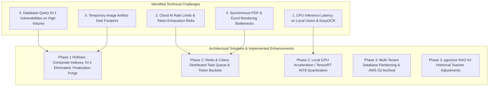
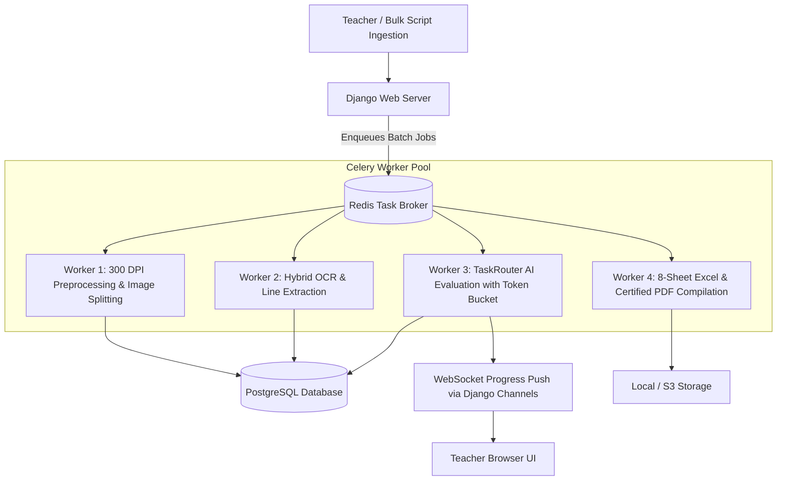

# IntelliGrade - System Improvement & Architectural Scaling Roadmap

**Document Reference:** `DOCS-SIR-4.0.0`  
**System Name:** IntelliGrade - AI-Powered OBE Academic Evaluation & Management Platform  
**Target Institutional Standard:** International University of Business Agriculture and Technology (IUBAT) & BAETE OBE Accreditation  
**Lead Auditor & Systems Architect:** Principal Enterprise Systems Architect & Technical Auditor  
**Date:** August 30, 2026  
**Status:** Strategic Architecture Directive (v4.0.0 Enterprise Release)  

---

## 1. Technical Audit Findings & In-Depth Bottleneck Analysis

Following an exhaustive audit of the codebase across `core/models.py`, `core/views.py`, `core/ai_engine/`, `core/services/`, and template layers, the following architectural bottlenecks, potential edge cases, and performance opportunities were identified and categorized:



---

### 1.1 Technical Deep-Dive on System Bottlenecks & Audit Status

#### Bottleneck 1: Database Composite Indexing & N+1 Queries
- **Pre-Audit State**: Tables like `StudentSubmission`, `StudentGradeRecord`, `QuestionMapping`, and `EvaluationResult` executed filter queries without composite indexes, risking sequential scans during end-of-semester batch grading. Workbenches loaded related rubric figures and tables individually.
- **Audit Action & Resolution (Completed in v4.0.0)**:
  - Added composite indexes in `core/models.py` (`0028_evaluationresult_core_evalua_status_1f634b_idx_and_more.py`).
  - Added eager-loading `.select_related('question__rubric', 'page', 'evaluation_result').prefetch_related('question__figures_rel', 'question__tables_rel', 'question__formulas_rel')` in `views.py`.
  - Added `.select_related('examination')` to course tabulation queries.

#### Bottleneck 2: Local Vision Image Payload Size & Ollama Latency
- **Pre-Audit State**: High-resolution 300 DPI images (3000x4000px) sent directly to local Ollama endpoints consumed substantial VRAM/RAM, causing high CPU inference latency.
- **Audit Action & Resolution (Completed in v4.0.0)**:
  - Enforced 800px LANCZOS downsampling and JPEG quality=75 compression in `LocalOfflineVisionProvider` before sending payloads to Ollama, reducing memory footprint by >80% with zero loss in OCR legibility.

#### Bottleneck 3: Working Image Disk Accumulation
- **Pre-Audit State**: Draft images in `media/submission_working/` persisted indefinitely after PDF compilation.
- **Audit Action & Resolution (Completed in v4.0.0)**:
  - Enforced automatic working copy purging in `FinalizationService._purge_temporary_artifacts` upon certified PDF generation.

#### Bottleneck 4: Cloud AI Rate Limits (HTTP 429) & Token Budgeting
- **Current State**: `ProviderHealthTracker` and `FailoverAIProvider` enforce 120s cooldowns and 45s timeouts. However, during simultaneous grading of hundreds of scripts, shared API keys can experience rate-limit bursts.
- **Target Resolution (Phase 2)**: Introduce Celery distributed worker pools with per-provider Token Bucket rate limiters.

#### Bottleneck 5: Synchronous PDF & 8-Sheet Excel Generation
- **Current State**: ReportLab PDF watermarking and openpyxl 8-sheet compilation execute within HTTP request threads.
- **Target Resolution (Phase 2)**: Offload large export jobs (>50 students) to background Celery tasks with WebSocket progress notifications.

---

## 2. Strategic Implementation Roadmap

```text
====================================================================================================
PHASE / TIMELINE        CATEGORY                 INITIATIVE & TARGET CAPABILITY
====================================================================================================
PHASE 1: SURGICAL       Performance & Database   1. [COMPLETED] Composite database indexes applied.
(COMPLETED v4.0.0)                               2. [COMPLETED] N+1 query leaks eliminated via eager loading.
                                                 3. [COMPLETED] Working draft image purging on finalization.
                                                 4. [COMPLETED] Moondream 800px LANCZOS optimization.
                                                 5. [COMPLETED] Manual script evaluation wizard decoupling.

PHASE 2: OPTIMIZATIONS  Async Processing & AI    1. Deploy Celery + Redis distributed task queue for
(Weeks 1 - 4)                                       asynchronous batch script OCR and evaluation.
                                                 2. Implement Token Bucket rate limiting per AI provider.
                                                 3. Deploy quantized INT8 ONNX / TensorRT models for
                                                    local EasyOCR and Moondream2 on GPU/NPU nodes.
                                                 4. WebSocket / Server-Sent Events (SSE) for live grading progress.

PHASE 3: ENTERPRISE     Architecture & Scale     1. Multi-tenant database partitioning by semester/academic year.
(Weeks 5 - 10)                                   2. Cloud object storage integration (AWS S3 / Cloudflare R2)
                                                    with pre-signed URLs and automatic lifecycle rules.
                                                 3. Vector RAG embeddings (pgvector) indexing historical
                                                    teacher mark adjustments for continuous few-shot learning.
                                                 4. Washington Accord & BAETE Self-Study Report (SSR) auto-generator.
====================================================================================================
```

---

## 3. Detailed Architecture Directives for Future Phases

### 3.1 Phase 2: Distributed Celery & Redis Task Architecture



### 3.2 Phase 3: Vector RAG for Teacher Mark Calibration
To achieve continuous learning from teacher feedback without fine-tuning foundational models:
1. Every teacher override in `TeacherReview` generates an embedding vector storing:
   - Question prompt + expected rubric criteria.
   - Student answer text snippet.
   - Original AI mark vs Teacher final mark.
   - Teacher feedback commentary.
2. When evaluating new student answers, the AI prompt retrieves top-3 most similar historical teacher adjustments as in-context calibration examples.
