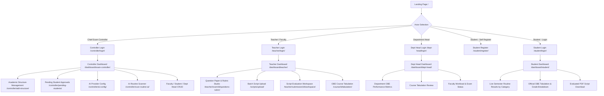

# IntelliGrade - Project Overview & Full Technical Audit Report

**Last Updated:** August 30, 2026
**Platform Version:** 3.5.0 (Enterprise Academic Edition)
**Target Institution Standard:** IUBAT (International University of Business Agriculture and Technology)
**Lead Auditor & Architect:** Principal Enterprise Systems Architect & Technical Documentation Specialist
**System Status:** Operational / Enterprise Ready (Django 5.2.x, Multi-Provider AI Failover, Real-time OBE Tabulation)

---

## 1. Executive Summary

**IntelliGrade** is an enterprise-grade, Outcome-Based Education (OBE) compliant, AI-powered academic evaluation and examination management SaaS platform built with Django, Python, and modern multimodal AI systems. The platform automates the end-to-end lifecycle of university examinations across the following eight pillars:

1. **Academic Hierarchy & Governance**: Chief Exam Controller and Department Head administrative control across Colleges, Schools, Departments, Courses, Faculty, and Students.
2. **AI Exam Routine Ingestion**: Automated multimodal OCR parsing of university examination schedules (`scan_routine_ai`) with 0ms local DB re-matching and bulk exam scheduling via `api_publish_exam`.
3. **23-Section Question Paper & Academic Rubric Taxonomy**: Full IUBAT OBE classification including Course Outcomes (CO1-CO5), Program Outcomes (PO1-PO12), Knowledge Profiles (KP1-KP8), Complex Engineering Problems (CEP1-CEP7), Complex Engineering Activities (CEA1-CEA5), Bloom Taxonomy levels, and extraction of Figures, Tables, and LaTeX mathematical formulas - all stored in the `Question` and `Rubric` models.
4. **Multimodal Answer Script Processing Pipeline**: 300 DPI high-resolution normalization, noise filtering, hybrid PyMuPDF -> PyTesseract -> EasyOCR failover OCR, regex state-machine question boundary detection, and interactive page mapping confirmation (`api_analyze_question_mapping`, `api_confirm_question_mapping`).
5. **AI Script Evaluation Engine (v3.0)**: `ScriptEvaluator` class with multi-provider task-aware failover orchestrator (`FailoverAIProvider`) dynamically routing between Local Offline Vision (Moondream2/Ollama), Groq (Llama-3.3-70B), OpenRouter, Google Gemini (2.5/2.0 Flash), and OpenAI (GPT-4o) with strict 45-second timeout budgets, 120-second HTTP 429 cooldown registries, and JSON LaTeX repair.
6. **Split-Screen Teacher Grading Workbench**: Side-by-side synchronized view (`evaluation_workspace`) of original high-res script, extracted OCR text, rubric criteria, AI score breakdowns with confidence rating, per-criteria mark overrides, question-level feedback, and full audit trails (`EvaluationAuditLog`, `EvaluationHistory`, `TeacherReview`).
7. **Real-time OBE Course Tabulation & Bi-directional Excel/PDF Synchronization**: Automated aggregation of Class Tests (10%), Midterm (25%), Final Exam (50%), Assignments (10%), and Attendance (5%) via `TabulationService.sync_submission_to_tabulation`. Generates 8-sheet OBE Excel workbooks (`HOME`, `ASSIGNMENT`, `CO_ATTAINMENT`, `PO_ATTAINMENT`, `CO_CLASS_ATTAINED`, `PO_CLASS_ATTAINED`, `CQI`) and stamped, certifiable evaluated student PDF scripts.
8. **Student & Department Dashboards**: Role-tailored portals for students to view real-time grades by examination routine type (Final, Midterm, CT-1, CT-2, Quiz, Assignment), answer breakdowns, certified PDF downloads, and OBE `StudentGradeRecord`; for Department Heads to monitor departmental pass rates, course progress, and faculty workloads.

---

## 2. Core Architecture & Technology Stack

| Layer | Technologies & Libraries | Function / Purpose |
| :--- | :--- | :--- |
| **Backend Framework** | Django 5.2.x (Python 3.11 / 3.13) | Monolithic MVT architecture, ORM, Auth, Template Engine, Session/Cache Management |
| **Database** | SQLite3 (Dev/Local) / PostgreSQL (Production) | Relational persistence, JSONField for dynamic rubrics, BBox coords, OBE scores, CO/PO maps |
| **Document & PDF Engine** | PyMuPDF (fitz), ReportLab, PyPDF2 | 300 DPI high-res page extraction, font glyph decoding, evaluated PDF watermarking & certificate stamps |
| **Computer Vision & Image Preprocessing** | OpenCV (cv2), NumPy, Pillow (PIL) | Deskewing via Hough Transforms, adaptive Gaussian/Otsu thresholding, BBox coordinate cropping |
| **OCR Engines** | PyTesseract, EasyOCR (PyTorch CPU fallback) | Multi-tier OCR: font text -> printed -> handwritten student scripts |
| **AI Failover Orchestration** | FailoverAIProvider, TaskRouter, ProviderHealthTracker | Dynamic task-aware routing, cooldown registries (HTTP 429 backoff 120s), timeout budgets (45s) |
| **AI LLM & Vision Providers** | Moondream2/Ollama, Groq (Llama-3.3-70B), Gemini (2.5/2.0 Flash), OpenRouter, OpenAI (gpt-4o) | Visual text extraction, rubric grading, Bloom classification, MCQ vision scanning, semantic evaluation |
| **Tabulation & Spreadsheet Engine** | openpyxl | 8-sheet enterprise Excel OBE workbook generation, formula compilation, bi-directional sync |
| **Asynchronous Notifications** | EmailService (threading.Thread) | Non-blocking institutional email dispatch (intelligrade@dsr.iubat.ac.bd, Port 465 SSL) |
| **Cache** | Django LocMemCache (intelligrade-security-cache) | OTP lifecycle management for password reset, evaluation progress tracking |
| **Frontend & UI** | Vanilla HTML5/CSS3, TailwindCSS 3.4.x, Inter/Google Fonts | Glassmorphism, dark/light themes, responsive modals, split-screen workbenches |

---

## 3. Comprehensive Actor Journey & Role Lifecycle



---

## 4. Actual Role Access Control Matrix (Ground Truth from core/views.py)

| Action | ADMIN / Chief Exam Controller | TEACHER (Assigned) | DEPT_HEAD | STUDENT |
| :--- | :---: | :---: | :---: | :---: |
| Manage Colleges / Schools / Depts | YES | NO | NO | NO |
| Add / Edit / Delete Faculty | YES | NO | NO | NO |
| Add / Edit / Delete Students | YES | NO | NO | NO |
| Approve Self-Registered Students | YES | NO | NO | NO |
| Create / Edit / Delete Exams | YES | NO | NO | NO |
| Create Courses | YES | NO | NO | NO |
| Configure AI Providers | YES | NO | NO | NO |
| Scan AI Routine | YES | YES | NO | NO |
| Publish Exams (AJAX) | YES | NO | NO | NO |
| Create Questions & Rubrics | YES (all) | YES (assigned only) | NO | NO |
| Upload Answer Scripts | YES | YES (assigned only) | NO | NO |
| Run AI Evaluation | YES | YES (assigned only) | NO | NO |
| Override AI Marks | YES | YES (assigned only) | NO | NO |
| Finalize Evaluation | YES | YES (assigned only) | NO | NO |
| View Course Tabulation | YES | YES | YES (dept) | NO |
| Export Excel / PDF Tabulation | YES | YES | YES (dept) | NO |
| View Own Evaluation Results | NO | NO | NO | YES |
| Download Certified PDF Script | NO | NO | NO | YES |

NOTE: DEPARTMENT_HEAD login supports both username and email authentication (unique feature in dept_head_login). Student login also checks is_approved status; unapproved students are logged out with a warning.

---

## 5. Key Subsystem Implementations & Verifications

### 5.1 Student Registration - Dual-Mode Creation

Two distinct creation paths exist for student accounts:

1. **Admin-Created** (add_student view): Account is created with is_approved=True immediately. A welcome email with raw credentials is dispatched via EmailService.send_account_creation_email.
2. **Self-Registered** (student_register view): Account is created with is_approved=False. Student sees a "pending approval" message. Admin reviews at /controller/pending-students/ and approves (approve_student) or rejects (reject_student, which DELETES the User object).

### 5.2 Examination Type Auto-Classification (Student Dashboard)

The resolve_exam_routine_info function in student_dashboard (view) performs regex-based exam type detection from Examination.title:

- **CT/Class Test**: regex `\b(?:class\s*test|ct)\s*[-#_]?\s*(\d+)\b` -> badges: amber, order_weight = 30+N
- **Quiz**: regex `\bquiz\s*[-#_]?\s*(\d+)\b` -> badges: cyan, order_weight = 40+N
- **Midterm**: 'mid' in title_lower -> badges: indigo, order_weight = 20
- **Assignment**: 'assign' in title_lower -> badges: purple, order_weight = 50
- **Lab/Practical**: 'lab' or 'practical' in title_lower -> badges: teal, order_weight = 60
- **Final** (default): All other titles -> badges: emerald, order_weight = 10

Student results are sorted by order_weight (Final shown first, then Midterm, then CTs, etc.).

### 5.3 Question Paper & Rubric Studio (question_rubric_manage)

Supports 5 document upload types per examination:
- question_paper_file - primary question paper (scanned or digital)
- rubric_file - standalone rubric/marking scheme
- course_outline_file - course learning outcome syllabus
- master_solution_file - golden benchmark answer script

AI-assisted operations:
- api_scan_question_paper - AI multimodal scanning of uploaded QP with progress tracking (api_get_scan_progress)
- api_finalize_scanned_paper - commits staged scan data to Question model
- api_ai_analyze_question_full - AI-generates Bloom level, CO/PO/KP/CEP/CEA, rubric levels, keywords
- api_generate_ai_rubric - AI-generates rubric criteria and mark distribution

Manual figure attachment: QuestionFigure.objects.create() triggered by manual_figure_file file upload.

### 5.4 Script Evaluation Pipeline - Phase Architecture (from ScriptEvaluator)

```
Phase 1 [prepare_and_ocr_submission]:
  -> 300 DPI rendering via PyMuPDF -> OpenCV preprocessing -> OCR
  -> Creates SubmissionPage records, cached by status guard

Phase 2 [QuestionMappingOrchestrator.analyze_and_build_mapping]:
  -> Regex + AI-based question header detection
  -> Stores QuestionMapping records with page_numbers_json

Phase 3 [evaluate_mapped_answers]:
  -> Pulls SubmissionAnswer records (with mapped pages)
  -> Calls _evaluate_answer_v3 sequentially (0.5s inter-call sleep)
  -> Dispatches to TaskRouter -> FailoverAIProvider chain
  -> Saves EvaluationResult, EvaluationFeedback, confidence flags
  -> Sets requires_manual_review = True if confidence < 0.75

Phase 4 [Post-Evaluation Sync]:
  -> SubmissionWorkflow.advance(status=AI_EVALUATED -> UNDER_REVIEW)
  -> TabulationService.sync_submission_to_tabulation(submission_id)
  -> EvaluationAuditLog entry written
```

**MCQ Fast-Path** (evaluate_mcq_submission): Separate pipeline for MCQ/Quiz exam types (< 3s). Detects via exam_type, rubric ideal_answer values in [A, B, C, D], or question text containing 'MCQ'. Bypasses multi-phase segmentation.

**Manual Evaluation Path** (initialize_manual_evaluation): Creates SubmissionAnswer and EvaluationResult placeholders with 0.0 marks and rubric steps pre-initialized. Teacher enters marks in the workspace.

### 5.5 OBE Tabulation & Grade Calculation (Ground Truth from tabulation_service.py)

The sync_submission_to_tabulation function:
1. Resolves student_id from student_roll_no or student_name.
2. Detects exam category from examination title using regex patterns (same as student dashboard).
3. Aggregates per-question marks and CO/PO scores from EvaluationResult objects.
4. Calls StudentGradeRecord.get_or_create per (tabulation, student_id).
5. **Skips update** if record.is_manually_edited == True (faculty lock override honored).
6. Calculates weighted total: (ct_avg% x w_ct/100) + (mid_avg% x w_mid/100) + (final_avg% x w_final/100) + (assign_avg% x w_assign/100) + att_marks
7. Default weights from CourseTabulation.weightage_config or hardcoded: {class_test: 10, midterm: 25, final: 50, assignment: 10, attendance: 5}.
8. Attendance is added as raw marks (not percentage-weighted) if any assessment exists.
9. **Stale record cleanup**: Orphaned StudentGradeRecord entries (no matching active submission) are purged.

**Letter Grade Boundaries** (both tabulation_service.py and student_dashboard):

| Score | Grade |
| :--- | :--- |
| >= 80 | A+ |
| >= 75 | A |
| >= 70 | A- |
| >= 65 | B+ |
| >= 60 | B |
| >= 55 | B- |
| >= 50 | C+ |
| >= 45 | C |
| >= 40 | D |
| < 40 | F |

### 5.6 Email Notification Pipeline (EmailService, threading.Thread)

All emails are dispatched asynchronously in a background threading.Thread with daemon=True. Triggered events:

| Event | Method | Recipients |
| :--- | :--- | :--- |
| Student/Faculty/Dept Head account creation | send_account_creation_email | Created user email |
| Student account approval | send_account_creation_email(is_approval=True) | Student email |
| Exam assigned to teacher | send_exam_assigned_to_teacher_notification | Teacher email |
| Course assigned to teacher | send_course_assigned_to_teacher_notification | Teacher email |
| Evaluation result published | send_evaluation_published_notification | Student email |

SMTP Configuration: intelligrade@dsr.iubat.ac.bd, Port 465 (SSL). Falls back to console.EmailBackend if EMAIL_HOST_USER is not set.

### 5.7 AI Provider Configuration (AIConfiguration Model)

The AIConfiguration.get_config() singleton (with pk=1 default) stores:
- primary_provider (GROQ / GEMINI / OPENAI / LOCAL / OLLAMA / OPENROUTER)
- groq_api_key, gemini_api_key, openai_api_key
- ollama_endpoint, ollama_model
- enable_local_vision, enable_ocr_fallback
- Provider health is tracked in AIProviderHealth model (per-provider health events, avg_response_time_ms, error_count, last_failure_at, last_success_at)

### 5.8 Password Reset Flow (OTP-Based)

Three-step flow:
1. forgot_password / api_forgot_password - generates 6-digit OTP, stores in LocMemCache with 10-minute TTL, sends OTP email.
2. verify_otp / api_verify_reset_otp - verifies OTP from cache, issues a session token.
3. reset_password - validates session token, sets new password via user.set_password(new_pw).

---

## 6. Complete URL Route Catalog (from core/urls.py - 102 routes total)

### Authentication Routes
| URL Pattern | View | Name |
| :--- | :--- | :--- |
| /controller/login/ | exam_controller_login | exam_controller_login |
| /teacher/login/ | teacher_login | teacher_login |
| /dept-head/login/ | dept_head_login | dept_head_login |
| /student/login/ | student_login | student_login |
| /student/register/ | student_register | student_register |
| /logout/ | logout_view | logout |
| /auth/forgot-password/ | forgot_password | forgot_password |
| /auth/verify-otp/ | verify_otp | verify_otp |
| /auth/reset-password/ | reset_password | reset_password |

### Dashboard Routes
| URL Pattern | View | Name |
| :--- | :--- | :--- |
| /dashboard/exam-controller/ | exam_controller_dashboard | exam_controller_dashboard |
| /dashboard/teacher/ | teacher_dashboard | teacher_dashboard |
| /dashboard/student/ | student_dashboard | student_dashboard |
| /dashboard/dept-head/ | dept_head_dashboard | dept_head_dashboard |

### Teacher / Evaluation Routes
| URL Pattern | View | Name |
| :--- | :--- | :--- |
| /teacher/exam/<id>/questions-rubric/ | question_rubric_manage | question_rubric_manage |
| /teacher/exam/<id>/start-evaluation/ | start_exam_evaluation | start_exam_evaluation |
| /teacher/exam/<id>/evaluate-scripts/ | evaluate_answer_scripts_list | evaluate_answer_scripts_list |
| /teacher/exam/<id>/evaluation-wizard/ | evaluation_wizard | evaluation_wizard |
| /teacher/exam/<id>/manual-evaluation/ | manual_evaluation_wizard | manual_evaluation_wizard |
| /teacher/submission/<id>/workspace/ | evaluation_workspace | evaluation_workspace |
| /scripts/upload/ | script_upload | script_upload |
| /evaluation/<id>/review/ | grading_workbench | grading_workbench |

### Submission / Evaluation API Routes
| URL Pattern | View | Name |
| :--- | :--- | :--- |
| /api/exam/<id>/upload-submission/ | upload_student_submission | upload_student_submission |
| /api/exam/<id>/upload-raw-images/ | api_upload_raw_images | api_upload_raw_images |
| /api/submission/<id>/run-evaluation-v3/ | api_run_evaluation_v3 | api_run_evaluation_v3 |
| /api/submission/<id>/analyze-mapping/ | api_analyze_question_mapping | api_analyze_question_mapping |
| /api/submission/<id>/confirm-mapping/ | api_confirm_question_mapping | api_confirm_question_mapping |
| /api/submission/<id>/reevaluate-v3/ | api_reevaluate_v3 | api_reevaluate_v3 |
| /api/submission/<id>/finalize/ | api_finalize_evaluation | api_finalize_evaluation |
| /api/submission/<id>/download-evaluated-pdf/ | api_download_evaluated_pdf | api_download_evaluated_pdf |
| /api/evaluation-result/<id>/review/ | review_evaluation_answer | review_evaluation_answer |

### Tabulation Routes
| URL Pattern | View | Name |
| :--- | :--- | :--- |
| /course/<id>/tabulation/ | course_tabulation_view | course_tabulation_view |
| /course/<id>/export-tabulation/ | export_course_tabulation | export_course_tabulation |
| /course/<id>/email-tabulation/ | email_course_tabulation_report | email_course_tabulation_report |
| /api/tabulation/grade-record/<id>/update/ | api_update_student_grade_record | api_update_student_grade_record |

---

## 7. System Health & Verification Summary

- **Django Check**: python manage.py check -> 0 issues identified (System healthy).
- **Dev Server**: Runs on http://127.0.0.1:8000, DEBUG=True via .env / environment variables.
- **Email**: Falls back gracefully to console.EmailBackend when EMAIL_HOST_PASSWORD is not set (development mode).
- **AI Fallback**: If all cloud providers are on cooldown or keys are absent, the system falls back to LocalOfflineVisionProvider (Moondream2/Ollama). Evaluations with confidence < 0.75 require teacher confirmation.
- **Recheck Module**: /controller/rechecks/ currently renders a static hardcoded list - live DB integration is pending (see SYSTEM_IMPROVEMENT_ROADMAP.md).
