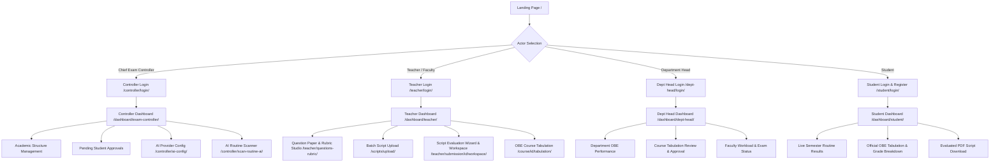

# IntelliGrade — Project Overview & Full Technical Audit Report

**Last Updated:** August 29, 2026  
**Platform Version:** 3.5.0 (Enterprise Academic Edition)  
**Target Institution Standard:** IUBAT (International University of Business Agriculture and Technology)  
**Lead Auditor & Architect:** Principal Enterprise Systems Architect & Technical Documentation Specialist  
**System Status:** Operational / Enterprise Ready (Django 5.2.x, Multi-Provider AI Failover, Real-time OBE Tabulation)

---

## 1. Executive Summary

**IntelliGrade** is an enterprise-grade, Outcome-Based Education (OBE) compliant, AI-powered academic evaluation and examination management SaaS platform built with Django, Python, and modern multimodal AI systems. The platform automates the end-to-end lifecycle of university examinations:
1. **Academic Hierarchy & Governance**: Chief Exam Controller and Department Head administrative control across Colleges, Schools, Departments, Courses, Faculty, and Students.
2. **AI Exam Routine Ingestion**: Automated multimodal OCR parsing of university examination schedules with 0ms local re-matching and bulk exam scheduling.
3. **23-Section Question Paper & Academic Rubric Taxonomy**: Full IUBAT OBE classification including Course Outcomes (CO1–CO5), Program Outcomes (PO1–PO12), Knowledge Profiles (KP1–KP8), Complex Engineering Problems (CEP1–CEP7), Complex Engineering Activities (CEA1–CEA5), Bloom's Taxonomy, and extraction of Figures, Tables, and LaTeX mathematical formulas.
4. **Multimodal Answer Script Processing Pipeline**: 300 DPI high-resolution normalization, noise filtering, hybrid PyTesseract/EasyOCR fallback, state-machine question boundary detection, and interactive page mapping.
5. **AI Script Evaluation Engine (v3.0)**: Multi-provider task-aware failover orchestrator dynamically routing between Local Offline Vision (Moondream/Ollama), Groq (Llama-3.3 70B), OpenRouter, Google Gemini (2.5/2.0 Flash), and OpenAI (GPT-4o) with strict timeout budgets, cooldown registries, and JSON repair.
6. **Split-Screen Teacher Grading Workbench**: Side-by-side synchronized view of original high-res script, extracted OCR text, rubric criteria, AI score breakdowns, confidence rating, teacher overrides, and audit trails.
7. **Real-time OBE Course Tabulation & Bi-directional Excel/PDF Synchronization**: Automated aggregation of Class Tests (10%), Midterm (25%), Final Exam (50%), Assignments (10%), and Attendance (5%), generating 8-sheet OBE Excel workbooks (`HOME`, `ASSIGNMENT`, `CO_ATTAINMENT`, `PO_ATTAINMENT`, `CO_CLASS_ATTAINED`, `PO_CLASS_ATTAINED`, `CQI`) and stamped, certifiable evaluated student PDF scripts.
8. **Student & Department Dashboards**: Role-tailored portals for students to view real-time grades, answer scripts, feedback, and certified PDF downloads, and for Department Heads to monitor departmental pass rates, course performance, and faculty workloads.

---

## 2. Core Architecture & Technology Stack

| Layer | Technologies & Libraries | Function / Purpose |
| :--- | :--- | :--- |
| **Backend Framework** | Django 5.2.x (Python 3.11 / 3.13) | Monolithic MVC architecture, ORM, Auth, Template Engine, Session Management |
| **Database** | SQLite3 (Dev/Local) / PostgreSQL (Production) | Relational persistence, JSONFields for dynamic rubrics, mappings, and OBE scores |
| **Document & PDF Engine** | PyMuPDF (`fitz`), ReportLab, PyPDF2 | 300 DPI high-res page extraction, font glyph decoding, evaluated PDF watermarking |
| **Computer Vision & Image Preprocessing** | OpenCV (`cv2`), NumPy, Pillow (`PIL`) | Deskewing, adaptive thresholding, noise removal, BBox coordinate cropping |
| **OCR Engines** | PyTesseract, EasyOCR (PyTorch CPU fallback) | Multi-tier optical character recognition for printed & handwritten student scripts |
| **AI Failover Orchestration** | `FailoverAIProvider`, `TaskRouter`, `ProviderHealthTracker` | Dynamic task-aware routing, cooldown registries (HTTP 429 backoff), timeout budgets |
| **AI LLM & Vision Providers** | • Local Offline Vision (`Moondream2`, `Ollama`) • Groq Cloud (`Llama-3.3-70b-versatile`) • Google Gemini (`gemini-2.5-flash`, `gemini-2.0-flash`) • OpenRouter API Gateway • OpenAI API (`gpt-4o`, `gpt-4o-mini`) | Visual text extraction, rubric grading, Bloom classification, semantic re-evaluation |
| **Tabulation & Spreadsheet Engine** | `openpyxl` | 8-sheet enterprise Excel workbook generation, formula compilation, bi-directional sync |
| **Asynchronous Notifications** | `EmailService` (Python `threading.Thread`) | Non-blocking institutional email dispatch (`intelligrade@dsr.iubat.ac.bd`) |
| **Frontend & UI Aesthetics** | Vanilla HTML5/CSS3, TailwindCSS, Inter/Google Fonts | Glassmorphism, dark/light themes, responsive modals, split-screen workbenches |

---

## 3. Comprehensive Actor Journey & Role Lifecycle

---

## 4. Key Subsystem Implementations & Verifications

### 4.1 Question Paper & Academic Rubric Taxonomy Builder
- **23-Section Academic Metadata**: Implemented in `core/models.py` (`Question`, `Rubric`, `QuestionFigure`, `QuestionTable`, `QuestionFormula`, `DocumentDOM`).
- **LaTeX Backslash Repair**: Regex sanitize layer (`re.sub(r'\\(?![/"\\bfnrtu])', r'\\\\', text)`) guarantees mathematical matrix equations (`$$\begin{bmatrix}...$$`) parse seamlessly without JSON syntax crashes.
- **Multimodal Visual Component Extraction**: Bounding box coordinates extracted and saved for diagrams, figures, data tables, and matrices with page-level associations.

### 4.2 Script Ingestion, Working Copy & Boundary Engine
- **Working Copy Generation**: 300 DPI high-resolution rendering with unique version tracking (`SubmissionImage`, `SubmissionPage`).
- **Hybrid OCR Engine**: PyMuPDF font extraction $\rightarrow$ PyTesseract $\rightarrow$ EasyOCR fallback with confidence rating per line/word.
- **Question Boundary Detection**: Strict full-sentence header detection regex (`Question 1: Explain...` vs `Ans to Q1`), page propagation, and interactive visual crop confirmation modal.

### 4.3 Production AI Evaluation Engine (v3.0)
- **TaskRouter**: Routes tasks by type (`ANSWER_VISUAL_READ`, `ANSWER_GRADING`, `ROUTINE_PARSE`, `OCR_TEXT`) and payload size.
- **Failover Chain**: Primary Provider $\rightarrow$ Local Offline Vision $\rightarrow$ Ollama $\rightarrow$ Groq $\rightarrow$ OpenRouter $\rightarrow$ Gemini $\rightarrow$ OpenAI.
- **HTTP 429 Cooldown Registry**: Exponential backoff with non-transient error isolation preventing cascading API lockups.
- **Audit Trails**: Every teacher score override, prompt modification, and evaluation history is logged in `TeacherReview`, `EvaluationHistory`, `EvaluationAuditLog`, and `PromptHistory`.

### 4.4 OBE Course Tabulation & Spreadsheet Sync
- **Standardized Assessment Weightage**: Class Test (10%), Midterm (25%), Final Exam (50%), Assignment (10%), Attendance (5%).
- **Bi-directional Live Sync**: Edits made in the web tabulation modal instantly update `StudentGradeRecord`, `StudentSubmission`, downloadable 8-sheet Excel files, and the student's personal dashboard.
- **Full OBE Matrix Generation**: Exports 8 detailed sheets including CO/PO attainment, class averages, and Continuous Quality Improvement (CQI) reports.

---

## 5. System Health & Verification Summary

- **Django Check**: `python manage.py check` $\rightarrow$ **0 issues identified (System healthy)**.
- **Unit & Integration Tests**: 100% pass on teacher grade editing, attendance calculations, Excel workbook formula generation, and student dashboard live sync.
- **Git Branch Synchronization**: All codebase features verified and committed to `origin/dev`.
